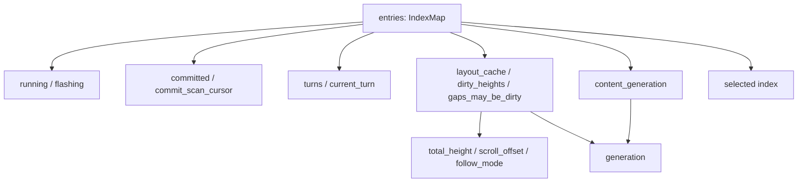
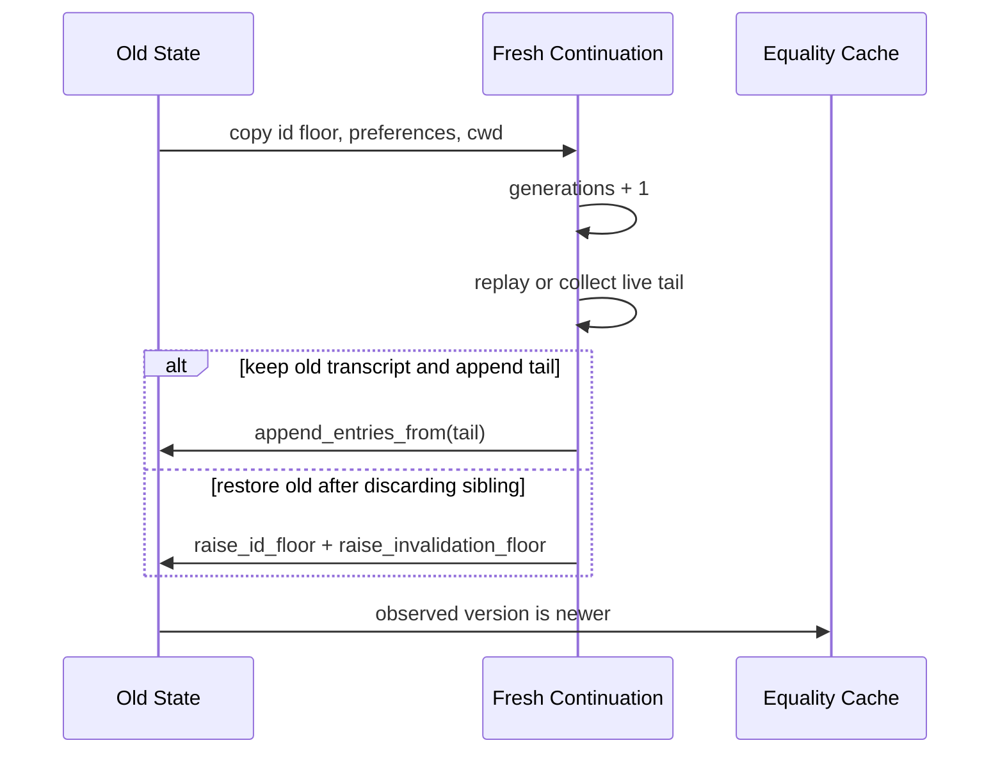

# 源码精读 02：`scrollback/state/mod.rs` 如何维护时间线的权威状态

> 源码基线：Git `ed6d543`。目标文件：`crates/codegen/xai-grok-pager/src/scrollback/state/mod.rs`，基线共 3504 行。
>
> 本篇不把 3504 行逐句翻译成中文，而是按“权威数据—派生索引—Mutation API—缓存失效—布局收敛—测试不变量”精读。行号用于固定本次阅读位置；源码变化后应优先按类型和函数名重新定位。

---

## 1. 为什么第二篇选择这个文件

`ScrollbackState` 是 Pager 对话时间线的权威状态容器。

Prompt、Answer、Thinking、Tool Call 等内容进入这里以后，还会衍生出：

- 稳定 Entry ID；
- 当前 Running 集合；
- Minimal Mode 已提交集合；
- Turn 边界；
- Selection；
- Scroll 与 Follow Mode；
- Entry Height 与 Virtual Y；
- Group Fold；
- 可见 Link Map 的失效版本；
- Search Index 的内容版本。

它适合学习真实系统里“修改一份数据，必须同步修复多少旁路状态”。

## 2. 本篇与 Walkthrough 34 的区别

Walkthrough 34 回答 Scrollback 功能怎样端到端工作。

本篇换一个观察角度：假设你正在 Review `state/mod.rs`，需要判断一次 Mutation 是否遗漏了 Cache、Generation、Selection、Turn 或 Commit Cursor 更新。

## 3. 文件并不拥有 ScrollbackState 的全部实现

开头的模块声明很重要：

```rust
pub mod groups;
mod layout;
mod nav;
mod selection;
mod timeline;
mod types;
pub mod verb_group;
```

Rust 允许不同子模块继续为同一个类型写 `impl ScrollbackState`。

因此只搜索 `mod.rs`，不能得出“这个类型没有 `scroll_up`”之类的结论。

## 4. 子模块怎样分工

| 文件 | 主要责任 |
| --- | --- |
| `state/mod.rs` | 字段、内容 Mutation、运行态、布局入口、测试 |
| `state/layout.rs` | Height、Gap、Virtual Y、Anchor、Paint Window |
| `state/nav.rs` | Scroll、Follow、Turn Navigation |
| `state/selection.rs` | Entry Selection、Fold/Expand、Raw Mode |
| `state/timeline.rs` | Turn 重建与可见范围 |
| `state/types.rs` | `Turn`、`ViewMode`、Snapshot 等类型 |
| `state/groups.rs` | 相邻条目的视觉分组 |
| `state/verb_group.rs` | Tool Verb Group 折叠规则 |

## 5. 一张状态依赖图



箭头表示“上游变化可能要求下游修复”，不是 Rust 引用关系。

## 6. 先写下八个核心不变量

1. `EntryId` 在一次会话身份链中不能被无意复用；
2. `entries` 的顺序就是时间线顺序；
3. `running`、`committed` 等集合里不应长期保留已删除 ID；
4. `selected` 是位置，插入、删除后必须修复；
5. `commit_scan_cursor` 不能跨过未提交 Entry；
6. Content 改变必须推进 `content_generation`；
7. 纯显示改变不能污染 `content_generation`；
8. `prepare_layout` 返回后，当前视口所需布局必须可用且 Scroll 合法。

后面的代码几乎都在维护这些不变量。

## 7. Glossary checkpoint：状态建模

| 名词 | 白话解释 | 本文件中的实例 |
| --- | --- | --- |
| Authoritative state | 其他结果最终都从它推导 | `entries` |
| Derived state | 为查询或渲染加速保存的结果 | `turns`、`layout_cache` |
| Invariant | 所有合法状态必须满足的约束 | Commit Cursor 不跨过未提交条目 |
| Mutation | 改变对象内部状态的操作 | `push`、`remove_entry` |
| Repair | Mutation 后同步修正旁路状态 | 调整 Selection、重建 Turns |
| Invalidation | 宣告旧 Cache 不可信 | `layout_cache = None` |

## 8. `ScrollbackState` 为什么不是一个简单 Vec

如果只有 `Vec<ScrollbackEntry>`：

- 顺序访问容易；
- 按 ID 找 Entry 需要 O(n)；
- 删除会移动下标；
- 异步搜索结果引用旧下标会失效。

源码选择 `IndexMap<EntryId, ScrollbackEntry>`，同时保留 Hash Lookup 与插入顺序。

## 9. `IndexMap` 提供的两套坐标

可以按 Key 访问：

```rust
self.entries.get(&id)
```

也可以按 Position 访问：

```rust
self.entries.get_index(index)
```

这正好对应稳定身份和当前显示位置两类需求。

## 10. ID 与 Index 不能互换

`EntryId` 是长期身份；`usize` Index 是当前排列位置。

插入一个 Entry 后：

- 原 Entry 的 ID 不变；
- 它以及后续 Entry 的 Index 可能加一。

搜索命中、Tracker 引用应保存 ID；Selection 和顺序遍历常使用 Index。

## 11. `next_id` 为什么从 1 开始

`new()` 里写明 0 可以保留为 Sentinel。

源码使用 `self.next_id += 1`，没有显式 `checked_add`。现实中耗尽 `u64` 几乎不可达，但从严格类型审查角度，它不是形式化的永不溢出证明。

## 12. `clear()` 为什么不重置 `next_id`

如果清空后从 1 重用 ID，旧 Search Match、Subagent Tracker 或其他外部引用可能误指向新 Entry。

所以清内容不等于清身份历史。

## 13. Glossary checkpoint：身份与位置

| 名词 | 解释 | 本文件中的实例 |
| --- | --- | --- |
| Stable ID | 容器重排后仍指向同一对象的标识 | `EntryId` |
| Positional index | 只描述当前排列位置的数字 | `selected: Option<usize>` |
| Sentinel | 用特殊值表示“无效/未设置” | 被预留的 ID 0 |
| Alias | 两个本应不同的引用误指向同一对象 | 清空后复用旧 ID 的风险 |
| Shift insert/remove | 插删后移动后续位置 | `shift_insert`、`shift_remove` |

## 14. `running` 是一个反向索引

Entry 自己有 `is_running`，State 还维护 `HashSet<EntryId>`。

这不是重复业务真相，而是性能索引：Animation Tick 只需处理 Running Entry，而不必每帧扫描全部历史。

## 15. `flashing` 为什么是 Vec 而不是 HashSet

它保存最近完成、仍可能处于 Finish Flash 的 ID。

`tick()` 用 `std::mem::take` 临时拿走 Vec，再 `retain` 未过期项。主要操作是顺序过滤，而不是频繁 Membership Lookup。

## 16. `dirty_heights` 为什么是 HashSet

Streaming Chunk 可能在一帧内多次写同一个 Entry。

HashSet 自动去重，使“一帧内多次变脏”仍只重算一次高度。

## 17. `committed` 表示什么

Minimal Mode 会把已经完成的内容打印进终端原生 Scrollback。

终端历史是 Append-only，打印过的文本不能原地改写，所以 State 必须记住哪些 Entry 已提交。

## 18. 为什么 `committed` 也按 ID 保存

如果按 Index 保存，删除前面的 Entry 后所有位置都会移动。

ID Set 随重排天然稳定；删除时只需删除对应 ID。

## 19. `commit_scan_cursor` 不是权威状态

权威答案在 `committed` Set。

Cursor 只是“最低可能未提交位置”的性能提示，让每帧提交从新内容附近开始，而不是重扫完整历史。

## 20. Cursor 最危险的不变量

Cursor 可以偏小：最多多扫描一些已提交 Entry。

Cursor 不能偏大并跨过未提交 Entry：那条内容既不会再次被扫描提交，也可能不在 Live Tail 中显示，于是静默消失。

这是“不准确会慢”和“不准确会错”的典型区别。

## 21. `commit_expand_ring` 为什么是有界队列

终端已提交的折叠文本无法回写展开。

Expand 操作只能在底部重新打印完整内容。Ring 保存最近可展开 ID，同时必须有界，避免长会话永久增长。

## 22. Scroll 高度为什么混用 `usize` 和 `u16`

- `scroll_offset`、`total_height`：长会话可能超过 65535 行，使用 `usize`；
- `viewport_height`：真实终端视口不会达到该规模，使用 `u16`。

类型宽度由数据生命周期决定，不应机械统一。

## 23. Follow Mode 是策略，不只是一个 Boolean

`follow_mode` 表示新内容到来时自动贴底。

`follow_preserve_scroll` 则允许一次特殊操作先把 Prompt 放到视口顶部，同时继续保持后续自动跟随；它会在一次处理后清除。

## 24. Selection 为什么保存 Index

Selection 的主要语义是“当前时间线中的第几个可导航 Entry”。

这让上下移动简单，但代价是插入和删除必须显式修复 Index。

## 25. `selection_box` 是帧派生结果

它不是用户长期选择的文本内容，而是当前 Frame 计算出的屏幕矩形。

State 保存它，是为了让 Scrollback Pane 计算后由外层 Frame 绘制。

## 26. Turn 字段组成第二层时间线

`turns` 从 Entry 序列重建；`current_turn` 是当前查看的 Turn Index；`view_mode` 决定显示全部 Turn 还是单 Turn。

因此内容插删后只修 Entry 不够，还要修 Turn Projection。

## 27. Glossary checkpoint：Minimal Mode 与视图

| 名词 | 解释 | 本文件中的实例 |
| --- | --- | --- |
| Native scrollback | 终端模拟器自己保存的历史 | Minimal Mode 已打印内容 |
| Append-only | 只能在末尾追加，不能改旧内容 | 已 Commit Entry |
| Frontier | 已处理区和待处理区的边界 | `commit_scan_cursor` |
| Follow Mode | 内容增长时保持视口贴底 | `follow_mode` |
| Projection | 从同一数据得到某种视图 | Single Turn View |

## 28. `last_width` 是 Cache Key 的一部分

同一段文本在宽 80 和宽 120 的终端里换行数不同。

因此 Width 变化不能沿用旧 Height Cache，必须让所有 Entry 的 Width-dependent Cache 失效。

## 29. `layout_cache: Option<LayoutCache>` 的语义

`None` 不仅表示“空”，还表示“当前没有可信布局”。

使用 Option 把 Cache Missing 变成类型状态，避免另设一个容易失配的 `layout_valid` Boolean。

## 30. `dirty_heights` 与 `layout_cache = None` 的区别

- Dirty Height：Cache 主体还可信，只需局部重测；
- Cache None：无法安全局部修补，下次走完整构建；
- `gaps_may_be_dirty`：Height 之外，Entry 间 Gap 或 Group Fold 结构也可能变化。

这三个信号对应不同成本级别。

## 31. Thinking Display Mode 是 State-owned Policy

Running Thinking 完成后是 Collapsed、Expanded 还是 Truncated，不应由每个调用方各自决定。

State 保存 `thinking_display_mode`，Finish Mutation 统一实施策略。

## 32. `tick` 为什么用 `wrapping_add`

动画帧号只用于循环效果，溢出后从 0 继续通常无害。

这与 Request ID 不同：后者若回绕可能误接纳旧响应，语义风险更大。

## 33. `batch_depth` 为什么不是 Boolean

Depth 支持嵌套批处理：内层 `end_batch` 不应提前执行最终 Rebuild。

只有深度回到 0，才统一重建 Turns 和使 Layout Cache 失效。

## 34. `end_batch()` 的防下溢策略

它使用 `saturating_sub(1)`。

多调用一次不会从 0 下溢成极大整数，但深度已经为 0 时仍会执行 Rebuild。因此它防住数值灾难，不等于严格检测 Begin/End 配对错误。

## 35. `warm_above` 为什么是三态枚举

Resize 后立刻预热视口上方数页很昂贵，而且同一 Frame 可能多次调用 `prepare_layout`。

三态表达：

```text
Idle -> Deferred -> Armed -> Idle
```

Frame Boundary 由 `begin_frame` 提供，不能仅靠调用次数猜测。

## 36. `ffmpeg_available_snapshot` 是环境状态快照

如果用户运行中安装 FFmpeg，图片 Poster 从 Banner 高度变为完整高度。

False→True 时必须重建布局，否则旧预留高度会让图片覆盖下方文本。

## 37. `expanded_groups` 为什么存 Group Start ID

Group 是从 Entry 序列推导的，不一定有独立实体。

用首 Entry ID 记录“这个组被手动展开”，既稳定又不需要再维护 Group Object 生命周期。

## 38. 两个 Generation 是全篇核心

```text
generation          可见链接位置或显示策略变化
content_generation  Entry 集合或 Entry 内容变化
```

后者推进时会同时推进前者；反过来不成立。

## 39. 为什么一个 Generation 不够

Scroll、Resize、Fold 都会让屏幕 Link 坐标变化，所以 Link Map 应重建。

但 Search Corpus 没变，不应重新提取所有文本。拆成两个版本后，各 Cache 订阅自己真正依赖的变化。

## 40. `bump_content_generation()` 的单向蕴含

实现是：

```rust
self.content_generation = self.content_generation.wrapping_add(1);
self.bump_generation();
```

即 Content Change ⇒ Display/Link Change。

## 41. Generation 并非形式化单调无限整数

两个 Counter 都使用 `wrapping_add`。

在可实现的会话长度里回绕几乎不可达，但严格说它是 Equality Token，不是数学意义上永不重复的时间戳；源码并未彻底消除理论 ABA。

## 42. Glossary checkpoint：缓存版本

| 名词 | 解释 | 本文件中的实例 |
| --- | --- | --- |
| Cache key | 判断缓存对应哪份输入的标识 | Generation |
| Invalidation token | 一变化就使消费者知道旧结果过期 | `generation` |
| Display-only change | 只改变呈现，不改变语料 | Scroll、Fold、Resize |
| Content change | 改变 Entry 集合或可搜索内容 | Push、Remove、Streaming Chunk |
| ABA | 值从 A 变 B 又回 A，Equality Consumer 误认未变 | Counter 理论回绕风险 |

## 43. `cwd` 为什么会影响显示

Tool Path 的展开、链接目标和布局可能依赖 Session CWD。

`set_cwd` 因此使所有 Entry Render Cache、Height 和 Layout 失效，并推进普通 `generation`。

## 44. `set_cwd` 为什么不推进 Content Generation

Entry 的原始 Tool 内容没变，Search Corpus 也不该因路径展示基准改变而重建。

这是 Display/Policy Input 与 Content 的边界案例。

## 45. `set_appearance` 的失效范围

Appearance 能改变颜色、Padding、折叠和高度，所以它：

- 清 Layout Cache；
- 标记 Gap 可能变化；
- 标记全部 Height Dirty；
- 使所有 Entry Render Cache 失效；
- 只推进普通 Generation。

## 46. `invalidate_heights` 为什么立即 Rebuild

进程级可见性开关变化时，它先使 Entry Cache 失效，再调用 `rebuild_layout()`。

既然已经完整重测，就清空 Dirty Set，避免下次 `prepare_layout` 再误入增量分支。

## 47. `mark_structurally_dirty` 做了什么

它同时：

- 把 ID 放入 `dirty_heights`；
- 把 `gaps_may_be_dirty` 设为 True。

适用于 Block Kind、Fold Membership 等可能改变相邻结构的原地 Mutation。

## 48. 为什么“高度脏”不总等于“结构脏”

Streaming Answer 变长时，通常只是尾部 Entry Height 增长，Entry 间分组关系不变。

如果每次 Chunk 都重建所有 Virtual Y 和 Group Gap，就丢失尾部 O(1) Fast Path。

## 49. `tick()` 先处理什么

它用 `wrapping_add` 推进动画 Tick，然后判断是否有 Running Entry 真正在 Viewport 内。

Off-screen Background Task 不应强迫静态屏幕每秒完整重绘约 30 次。

## 50. Finish Flash 的 `mem::take` 模式

`std::mem::take(&mut self.flashing)` 用一个空 Vec 替换字段，把旧 Vec 移到局部变量。

这样 Closure 在筛选时可继续访问 `self.entries`，避免同时借用 `self.flashing` 和 `self` 引发 Borrow Conflict。

## 51. O(running) 与 O(history)

`tick_running()` 先复制 Running IDs，再逐个使对应 Entry Cache 失效。

成本由活跃任务数决定，而不是历史总 Entry 数。这是长会话 UI 的关键尺度选择。

## 52. `needs_animation()` 与 `tick()` 不完全相同

前者回答是否存在 Running、Flashing 或 Pending User Input 等动画来源；后者还判断当前 Frame 是否实际需要 Redraw。

“需要继续驱动时钟”和“这一帧需要重画”是两个问题。

## 53. `push()` 的第一阶段：分配身份

流程是：

1. 从 `next_id` 创建 ID；
2. 推进 Counter；
3. 覆盖传入 Entry 的 ID；
4. 应用 Edit 默认显示策略；
5. 若 Running，加入反向索引；
6. 插入 `IndexMap`。

调用方不能自行决定最终 ID。

## 54. `push()` 的第二阶段：维护派生状态

非 Batch 模式先重建 Turns，再尝试把新 Entry O(1) 追加进现有 Layout Cache。

如果 Cache 不可扩展，就退化为完整失效，交给下一次 `prepare_layout` 重建。

## 55. O(1) Layout Extend 何时还不够

新 Entry 若是可分组且处于 Collapsed 状态，可能让一个 Group 超过截断阈值，或扩展 Verb Group Run。

即使单条 Height 已追加，仍要标记 Structural Dirty，让 Group Pass 重跑。

## 56. Batch 中的 `push()` 实际做什么

它跳过每条 Entry 的 Turn Rebuild 和 Layout Incremental Extend；把 `gaps_may_be_dirty` 设为 True，并把 `layout_cache` 置 None。

每次置 None 本身便宜；真正昂贵的重建推迟到 Batch 结束后或下次布局准备。

## 57. 每次 `push()` 都推进 Content Generation

即使处于 Batch，也不会把多个 Push 合并成一次 Generation。

Batch 优化的是重建工作，不改变每次 Mutation 的可观察版本语义。

## 58. `push_block()` 只是便利封装

它把 `RenderBlock` 包装成 `ScrollbackEntry::new`，再交给 `push`。

身份分配和失效规则仍只有一处权威实现。

## 59. `insert_block_before()` 的 Missing Anchor 策略

如果 Anchor 已不存在，它退回 `push_block`。

这选择了“保留内容并追加”而不是“整个操作失败”，适合异步事件晚到时的容错。

## 60. 插入为什么要修 Selection

若当前 Selection Index 大于等于插入位置，原来选中的 Entry 被向后推一位。

源码把 `selected += 1`，保持选中的是同一 Entry，而不是同一数字位置。

## 61. 插入为什么要下调 Commit Cursor

新 Entry 插在 Cursor 之前时，它尚未 Commit。

`min(index)` 把扫描起点拉回插入位置，确保新内容不会被 Frontier 跨过。

## 62. 已 Commit Anchor 的 Precondition 强度

源码用 `debug_assert!` 拒绝在已打印 Entry 之前插入。

它在 Debug/Test Build 会 Panic；在 Release Build 不构成运行时强制保护。因此调用链仍必须遵守契约，不能把它当安全边界。

## 63. `remove_entry()` 的清理清单

成功 `shift_remove` 后，它清理：

- `running`；
- `dirty_heights`；
- `committed`；
- `expanded_groups`；
- Selection 越界；
- Commit Cursor；
- Turns；
- Layout Cache；
- Content Generation。

这份清单是新增 ID-indexed 字段时必须回看的地方。

## 64. 删除前为什么先捕获 Index

`shift_remove` 后已无法直接知道 Entry 原来的位置。

Commit Cursor 的修复依赖“删除是否发生在 Cursor 之前”，所以必须先取 Index。

## 65. 删除前方 Entry 如何修 Cursor

若 `removed_index < commit_scan_cursor`，后续 Entry 全部左移一位，Cursor 也减一。

最后再 Clamp 到当前 Length，覆盖删除尾部等情况。

## 66. `remove_from()` 为什么 Reverse Removed

它从尾部不断 `pop`，自然得到逆序结果。

返回前 `reverse()`，让调用方看到的 Removed Entries 仍保持原时间线顺序。

## 67. `clear()` 的完整语义

它清 Entry 与所有会悬空的派生集合，重置 Selection、Turn、Scroll、Commit Frontier 和 Expand Ring，失效布局并推进 Content Generation。

但保留 `next_id`、Appearance 和用户视图策略。

## 68. Glossary checkpoint：Mutation Review

| 名词 | 解释 | 代码审查问题 |
| --- | --- | --- |
| Bookkeeping | 为保持一致性维护的辅助数据 | 是否清理所有 ID Set？ |
| Fallback | 主路径不可用时的保底行为 | Anchor 丢失后 Append |
| Precondition | 调用前必须成立的条件 | Anchor 未 Commit |
| Debug assertion | Release 可被移除的开发期断言 | `debug_assert!` |
| Clamp | 把值限制到合法范围 | Cursor 不超过 Length |

## 69. Streaming API 为什么按 Block 类型分开

`push_chunk_to_agent`、`push_chunk_to_thinking`、`push_chunk_to_execute` 分别 Pattern Match 目标 Block。

ID 存在但类型不对时返回 False，防止把一类流式事件写进另一类 Entry。

## 70. 一次 Streaming Mutation 的标准四步

1. 修改 Block 内容；
2. `entry.invalidate_cache()`；
3. 把 ID 加入 `dirty_heights`；
4. `bump_content_generation()`。

这是新增 Streaming Block API 时最值得复制的模板。

## 71. Deferred Chunk 延迟了什么

`push_chunk_to_agent_deferred` 和 Thinking 对应版本仍写入内容并推进版本。

它们延迟 Markdown 渲染工作，不延迟“内容已变化”这一事实。

## 72. Execute Output 有两种协议形态

- `set_execute_output`：上游发完整累计 Buffer，直接替换；
- `append_execute_output`：上游发 Delta，委托给 Chunk Append。

API 名字把 Full Snapshot 与 Incremental Delta 区分开。

## 73. Execute Chunk 为什么无条件标 Height Dirty

即使 Chunk 没有换行，Word Wrap 也可能让显示行数改变。

不能用“是否包含 `\n`”作为高度变化判断。

## 74. `mark_height_dirty()` 名字比实际动作更宽

它不仅加入 Dirty Set，还设置 Structural Dirty、清 Layout Cache、推进 Content Generation。

注释说明它用于调用方通过 Raw Mutable Access 修改 Entry 内容后补做失效。读 API 时应看实现，不只凭名字推断成本。

## 75. Mutable Accessor 是责任边界

`get_mut`、`last_mut`、`get_by_id_mut`、`entries_mut` 会把 `&mut ScrollbackEntry` 交给调用方。

Rust 保证没有数据竞争，却不会自动推进 Generation 或更新 Dirty Set。调用方修改影响显示或内容的字段后，必须调用合适的 State API 补做失效。

## 76. 为什么优先使用专用 Mutation API

专用 API 把业务修改和 Repair 放在同一处，较难遗漏。

Raw Mutable Access 适合内部批量或特殊修改，但扩大了不变量审计范围。

## 77. `set_inline_edit_height` 的双向失效

Override 从旧 Entry 移到新 Entry 时，旧 Entry 要恢复 Natural Height，新 Entry 要采用 Editor Height。

所以函数同时标记 Old ID 和 New ID Dirty。

## 78. Hook Attach 是结构变化

Hook Chrome 会改变 Tool Row 是否参与 Verb Group。

`attach_hooks` 使 Entry Render Cache 失效并调用 `mark_structurally_dirty`，而不只是修改显示文字。

## 79. Hook Attach 与 Content Generation 的当前边界

基线实现没有在 `attach_hooks` 中直接调用 `bump_content_generation()`。

可确认的源码事实是：它把 Hook 视为 Render/Group Structural Mutation。是否应进入某个内容派生 Cache，要以该 Cache 的 Corpus 定义和测试为准，不能仅凭“字段变化”武断判 Bug。

## 80. `replace_tool_block()` 为什么集中复杂策略

Tool Placeholder 会被更准确的 Block 替换；Edit 在执行中还可能从可信摘要变成不可信摘要。

函数统一处理 Started Time、Manual Fold、Default Mode、Untrusted Rising Edge、Cache 与 Verb Group Kind，避免 Tracker 各写一套策略。

## 81. “Untrusted Rising Edge” 是什么

旧 Edit 摘要可信，新结果显示它涉及多文件而摘要不再完整时，Collapsed One-liner 可能误导。

只在 False→True 的边沿自动展开；已经不可信后用户再次折叠，后续更新应尊重手势。

## 82. Manual Pin 为什么优先

当 `respect_manual_folds` 开启，用户显式选择的 Fold State 应压过自动默认策略。

这体现“初始化策略”和“用户意图”不是同一优先级。

## 83. `set_entry_running()` 同时维护什么

它修改 Entry Flag、使 Render Cache 失效、维护 Running Set，并在 False→True 时给 Tool Call 启动计时。

构造函数不提前 Stamp `started_at`，真正进入 Running 的状态转换才是计时起点。

## 84. Finish 操作为什么不能只改 Boolean

结束 Running 还可能涉及：

- 从 Running Set 移除；
- 加入 Finish Flash；
- 记录 Thinking Time；
- 应用 Thinking Fold Policy；
- 清 Pending User Input；
- 使 Height/Cache/Generation 失效。

状态转换的副作用比字段名更重要。

## 85. `finish_all_running()` 的恢复语义

Reconnect Restore/Merge 后，旧 Tracker 不一定知道断线前哪些 Entry 仍 Running。

遍历当前 Running ID 快照并逐个 Finish，防止它们永久动画。

## 86. Pending User Input 为什么是 Structural

等待权限或问题回答的 Tool Row 会从 Verb Group Run 中退出，以便单独显示提示。

Flag 变化不需要重建文本 Cache，却必须重跑 Group/Fold 结构。

## 87. `clear_all_pending_user_input()` 为什么先收集 ID

它先 Immutable Iteration 收集 Flagged IDs，再逐个 Mutable Update。

这避开同时遍历 `entries` 又调用会借用整个 `self` 的方法所产生的 Borrow Conflict。

## 88. Glossary checkpoint：Rust 借用与状态转换

| 名词 | 解释 | 本文件中的实例 |
| --- | --- | --- |
| Mutable accessor | 返回可修改引用的方法 | `get_by_id_mut` |
| Borrow conflict | 同一时刻的借用组合不被 Rust 接受 | 遍历中再次借用 `self` |
| Transition edge | 状态从一个值首次切到另一个值 | Running False→True |
| User intent | 用户明确操作形成的高优先级状态 | Pinned Fold |
| Structural mutation | 改变 Entry 间组织关系的修改 | Pending Row 退出 Verb Group |

## 89. `fresh_continuation()` 解决什么问题

Reconnect 时系统可能创建一个空 State，在其中 Replay 或接收 Live Tail，同时暂存旧 State 以便恢复。

新旧 State 是同一身份链的 Sibling，而不是两段独立会话。

## 90. Continuation 保留什么

它保留：

- `next_id`；
- Appearance；
- Thinking Display Mode；
- View Mode；
- Follow Mode；
- CWD；
- 两个 Generation 的连续性。

## 91. Continuation 重置什么

它从空内容开始，因此 Entry、Selection、Scroll Position、Turns 等使用 `new()` 默认值。

这是一份“身份和偏好连续、内容与视口重新开始”的 State。

## 92. 为什么新 Continuation 的 Generation 先加一

Cache Consumer 可能刚见过旧 State 的 Counter。

如果空新 State 使用相同值，Equality Check 会把完全不同的内容误认成旧 Cache 仍有效。

## 93. `raise_id_floor()` 的作用

如果临时 Sibling 已分配一些 ID，随后系统恢复旧 State，就要把旧 State 的 `next_id` 提升到 Sibling 使用过的上界。

被丢弃 Sibling 的 ID 也不能重用，否则外部悬空引用可能别名到新 Entry。

## 94. `raise_invalidation_floor()` 的作用

恢复旧 State 时，也要把两个版本推进到被丢弃 Sibling 之后。

否则刚为 Sibling 建好的 Search Index 或 Link Map 可能错认恢复后的 State。

## 95. `append_entries_from()` 的合并合同

它要求 Tail 来自共享 ID 空间的 Fresh Continuation Sibling。

`debug_assert!(tail.next_id >= self.next_id)` 只验证一个必要线索，并不能证明没有任意 ID 冲突；正确性仍依赖调用协议。

## 96. Merge 时哪些 ID Set 必须一起合并

源码合并：

- Entries；
- Running；
- Dirty Heights；
- Committed；
- Expanded Groups。

然后取更大的 `next_id` 和两个 Generation，再重建 Turns、失效 Layout、推进 Content Generation。

## 97. 为什么 Generation 取 Max 后还要再 Bump

Max 保证不落后于任一半；再 Bump 保证“合并结果”严格新于两半。

消费者最近看到任一 Sibling，都不会把 Merged State 当成同一版本。

## 98. 一张 Continuation 时间线



## 99. Glossary checkpoint：恢复与分支

| 名词 | 解释 | 本文件中的实例 |
| --- | --- | --- |
| Continuation | 延续原身份空间的新状态 | `fresh_continuation` |
| Sibling | 从同一旧状态分出的同级状态 | 暂存旧内容与新 Replay State |
| ID floor | 未来分配 ID 的最小值 | `next_id` 下界 |
| Invalidation floor | Cache Version 至少必须超过的值 | Sibling Generation 上界 |
| Merge | 合并两段状态并重新建立派生结构 | `append_entries_from` |

## 100. `prepare_layout()` 是渲染前唯一收敛入口

注释明确要求：Viewport 可能变化时，Render 前先调用它。

它集中处理尺寸、Cache、Total Height、Follow Mode、Lazy Exact Measurement 和 Resize Warm-up。

## 101. 为什么布局使用“估算后精测”

长历史若每次 Resize 都精确渲染测量所有 Entry，成本随历史线性增长。

源码先为全量 Entry 建 Cheap Estimate，再只把当前 Viewport 附近升级成 Exact Height。

## 102. `prepare_layout` 的三条主分支

| Case | 条件 | 主要动作 |
| --- | --- | --- |
| 1 | Cache Missing 或 Width Changed | 全量 Estimated Rebuild |
| 2 | 有 Dirty Heights | 局部重测，必要时修 Virtual Y |
| 3 | 无结构变化 | 更新可见范围总高、Follow、按需精测 |

## 103. 入口先检查 FFmpeg 环境变化

False→True 时，Poster Reservation 可能改变，函数把 Gap 标脏并使 Layout Cache 失效。

这个环境变化最终会把执行导向 Case 1。

## 104. Viewport 变化为什么推进普通 Generation

Width/Height 改变后，链接在屏幕上的坐标会变化。

内容语料不变，所以只推进 `generation`，不推进 `content_generation`。

## 105. Case 1 为什么先捕获 Scroll Anchor

Width 变化会重新换行，同一个绝对 Row Offset 可能指向完全不同的内容。

非 Follow Mode 下先记住视口顶部的 Entry 与内部相对位置，重建后再定位它。

## 106. Follow Mode 为什么不捕获 Anchor

Follow 的目标本来就是重新贴底；`follow_preserve_scroll` 也会由自己的策略处理。

此时保留旧顶部内容会与 Follow Policy 冲突。

## 107. Width Changed 的失效粒度

源码遍历所有 Entry，调用 `invalidate_width_caches()`，再更新 `last_width`。

这比无条件清除一切语义更精确：明确是 Width-dependent Render Data 过期。

## 108. Case 1 的收敛顺序

1. 建全量 Estimated Layout；
2. 计算 Total Height；
3. 恢复 Scroll Anchor；
4. 修复被 Group 隐藏的 Selection；
5. 应用 Follow Mode；
6. 精测当前 Viewport；
7. 立即或延迟预热上方页面；
8. 清 Dirty/Structural Flags。

顺序错误会导致 Scroll Jump 或使用旧 Height 定位。

## 109. Resize 为什么延迟 Warm Above

拖动终端边缘时会产生连续 Width Event。

每次都预热数页，下一 Width 到来又全部作废。源码把 Warm 标为 Deferred，等下一 Frame Boundary 后才 Armed 并执行。

## 110. Case 2 先得到什么

`update_dirty_entry_heights(width)` 返回发生 Height 变化的条目及变化信息，然后立刻清 Dirty Set。

接下来是否重建全部 Virtual Y，由 `gaps_may_be_dirty` 与 Changes 是否为空共同决定。

## 111. Structural Dirty 的 Case 2

若 Gap/Fold 也可能改变，局部 Height 值不足以确定所有位置。

源码完整重建 Virtual Y、重算 Total Height，并修复 Hidden Selection。

## 112. Streaming Fast Path 的 Case 2

若只有 Height 变化且 Gap 稳定，从最早 Dirty Index 开始修补后续 Virtual Y。

尾部 Streaming 时最早 Dirty 通常就是最后一项，因此接近 O(1)。

## 113. Total Height Delta 如何防下溢

源码先转换为有符号数计算 Delta，再 `.max(0)`，最后转回 `usize`。

这是因为 Height 可能变小，而无符号直接相减会下溢。

## 114. Height 没变但 Structural Dirty 仍要重建

新增 Collapsed Groupable Entry 可能改变 Group Truncation，却恰好没有改变单 Entry Height。

因此 `changes.is_empty()` 不能单独证明 Layout Structure 未变。

## 115. Case 3 为什么仍重算 Total Height

Visible Entry Range 可能因 View Mode 或 Turn Navigation 改变，即使 Entry Height 没脏。

对当前 Slice 求和成本较低，换来一致性更稳妥。

## 116. Case 3 为什么还要 Settle

用户纯滚动会把此前只估算的 Off-screen Entry 带进 Viewport。

即使没有内容 Mutation，也必须把新可见区域升级为 Exact Measurement。

## 117. `prepare_layout()` 返回值不要过度解读

True 表示进入 Case 1/2 的 Rebuild 路径；Lazy Settle 也可能调整 Height/Scroll，却不计入返回值。

注释还说明唯一调用方忽略该值，所以它不是完整的“这一帧是否变化”信号。

## 118. `begin_frame()` 是 Host Contract

Host 每 Frame 调一次，才能把 Deferred 变 Armed。

如果遗漏这个调用，Resize 后的 Warm-up 可能长期不执行；如果每次 Prepare 都调用，则又失去真正 Frame Boundary 的意义。

## 119. Glossary checkpoint：布局算法

| 名词 | 解释 | 本文件中的实例 |
| --- | --- | --- |
| Estimated height | 不完整渲染得到的廉价高度 | 全历史初建 |
| Exact measurement | 根据真实渲染得到的高度 | Viewport 内 Entry |
| Virtual Y | Entry 在完整虚拟文档中的纵坐标 | Layout Cache Position |
| Scroll anchor | Resize 前后保持同一内容位置的书签 | `ScrollAnchor` |
| Settle | 用精确测量修正估算并重新钉住视口 | `settle_visible_measurements` |
| Warm-up | 提前测量即将滚入的内容 | `warm_measure_pages_above` |

## 120. Viewport Snapshot 保存什么

`capture_viewport_snapshot()` 保存 Scroll、Follow、Viewport 尺寸、Last Width、Selection、Current Turn、View Mode 和 Total Height。

它用于临时 Guest Mutation 后恢复用户观察位置。

## 121. Restore 实际恢复什么

`restore_viewport_snapshot()` 恢复除 `total_height` 外的上述字段，并使 Layout Cache 失效。

虽然 Snapshot 类型携带 `total_height`，基线实现不直接赋回它；后续 Layout Prepare 会重新计算可信高度。

## 122. 为什么 Restore 后必须失效 Cache

Guest Mutation 期间 Entry 或 Width-dependent Peek Cache 可能改变。

仅把 Scroll 数字写回去，会把旧位置套在新布局上；先失效再 Prepare 才能重新收敛。

## 123. `set_scroll_offset()` 的两个职责

它用：

```text
max_offset = total_height.saturating_sub(viewport_height)
scroll_offset = min(requested, max_offset)
```

并关闭 Follow Mode，因为用户已主动定位视口；同时推进普通 Generation。

## 124. 为什么用 `saturating_sub`

当内容比 Viewport 矮，普通无符号减法会下溢。

Saturating Sub 让最大 Offset 自然为 0。

## 125. Group Hidden 查询依赖 Layout Cache

`entry_content_hidden_by_group` 会参考 Group Header 和 Height 0 等布局结果。

这说明“内容存在于 Entries”与“内容当前可画”是两层不同事实。

## 126. 一张 Mutation 决策表

| Mutation | Entry Cache | Height | Structure | Turns/Position | Content Gen | Display Gen |
| --- | --- | --- | --- | --- | --- | --- |
| Push/Remove | 新建或移除 | Rebuild/Extend | 可能 | 修复 | 是 | 随 Content |
| Streaming Chunk | 失效目标 | Dirty 目标 | 否 | 否 | 是 | 随 Content |
| Fold/Raw/Scroll | 按实现 | 可能 | 可能 | View-only | 否 | 是 |
| Appearance/CWD | 全部失效 | 全部 | 可能 | 否 | 否 | 是 |
| Hook Attach | 失效目标 | Dirty 目标 | 是 | 否 | 当前未直接推进 | 由后续显示路径决定 |
| Resize | Width Cache 失效 | 全量估算+可见精测 | 是 | Anchor 修复 | 否 | 是 |

表格是 Review Checklist，不代替具体函数实现。

## 127. 新增 Mutation API 时的审查顺序

先问七个问题：

1. Entry 原始内容变了吗？
2. Searchable Corpus 变了吗？
3. Render Cache 还可信吗？
4. Height 会变吗？
5. Group/Gap Membership 会变吗？
6. Entry 顺序、Selection、Turn、Commit Cursor 会变吗？
7. Link Position 或 Policy 会变吗？

根据答案选择失效动作，而不是一律 Full Rebuild。

## 128. 常见错误一：只改 Entry 字段

通过 `get_by_id_mut()` 修改内容后忘记 Invalidations，会出现：

- 画面仍显示旧 Cache；
- Height 与实际文本不符；
- Search Index 不重建；
- Link Map 仍认为有效。

编译器无法发现这种逻辑失配。

## 129. 常见错误二：所有变化都推进 Content Generation

这样功能可能仍正确，但 Scroll、Hover、Resize 会频繁重建 Search Corpus。

Generation 分层的性能设计会被悄悄破坏。

## 130. 常见错误三：只 Clamp Commit Cursor

删除 Cursor 前方 Entry 时只做 `min(len)`，Cursor 数值可能仍在合法范围，却相对未提交内容向右偏了一位。

必须根据 Removed Index 调整，而不只是防越界。

## 131. 常见错误四：把 ID Set 当自动同步

Rust 不会因为 Entry 从 `IndexMap` 删除，就自动从 `running`、`committed`、`expanded_groups` 删除同一 ID。

所有反向索引都需要显式 Bookkeeping。

## 132. 常见错误五：把 Debug Assert 当生产保护

`insert_block_before` 和 `append_entries_from` 的若干合同由 `debug_assert!` 表达。

Release Correctness 主要依赖调用协议；若输入来自不可信边界，应使用普通检查和显式错误。

## 133. 测试区应怎样读

不要按文件顺序逐个看 Assert。

先按不变量分组：初始化、身份、Mutation、Generation、布局、恢复、Thinking Policy、Hook Attribution，再回看每组的 Setup 为什么必要。

## 134. 初始化与基础容器测试

`test_empty_state` 固定 Empty State 的 Length、Selection、Follow 等默认值。

`test_push_and_selection`、`test_iter_entries_yields_all_in_order`、`test_get_by_id_is_o1` 固定双坐标容器的基本行为。

测试名中的 O(1) 是对所选 API/容器路径的设计断言，不是基准测试证明。

## 135. Continuation 测试固定什么

相关测试验证：

- ID 不复用；
- Generation 连续；
- View Preference 保留；
- Merge 后 Tracker Reference 仍指向正确 Entry；
- 恢复旧 Sibling 后 Floor 被抬高。

它们在防低概率但破坏性极高的缓存别名错误。

## 136. Content Generation 三组测试

- `test_content_generation_bumps_on_content_changes`；
- `test_content_generation_unchanged_by_display_toggles`；
- `test_content_generation_unchanged_by_scroll_and_resize`。

这三组同时测试正例和反例，比只测“Push 会加一”更能固定分层合同。

## 137. Insert Before 测试为什么密集

它覆盖：

- 位置正确；
- ID 唯一；
- Anchor 丢失 Fallback；
- Selection 跟随原 Entry；
- Commit Frontier 不遗漏；
- 已 Commit Anchor 在 Debug 下拒绝；
- Turn Index 重建。

一个看似简单的 Insert 实际跨越六套派生状态。

## 138. Streaming 测试的三种输入

`test_push_chunk_to_agent` 测成功；另两项测试 ID 不存在和 Block 类型错误。

Mutation API 的失败分支同样重要：返回 False 时不应误推进状态或 Panic。

## 139. Batch 与 Layout 测试固定什么

`test_push_then_prepare_layout_updates_total_height` 连接内容 Mutation 与布局收敛。

`test_push_in_batch_still_nullifies_cache` 防止 Batch 优化错误保留旧 Cache；`test_push_into_empty_state_with_no_cache` 固定空状态边界。

## 140. Dirty Height 测试固定什么

`test_mark_height_dirty` 检查显式失效；`test_dirty_heights_cleared_after_prepare_layout` 确保消费 Dirty 标记后不会每帧重复进入增量路径。

Dirty Flag 的清理与设置同样属于合同。

## 141. Pending Input 测试固定什么

测试覆盖 Flag Toggle 是否报告真实变化，以及 Completion 是否清除 Pending 状态。

这防止已完成 Tool 仍显示“等待用户输入”并持续驱动动画。

## 142. Thinking Finish 测试固定什么

测试分别覆盖：

- 用户已展开的 Running Thinking 完成后保持展开；
- 未触碰项按默认折叠；
- 用户切回 Truncated 后按策略收敛；
- Sticky Expanded Mode 对未触碰项生效。

它们在区分默认策略和用户手势。

## 143. Snapshot 测试固定什么

`viewport_snapshot_restore_roundtrip_after_guest_mutate` 验证主要视口字段回滚。

`restore_invalidates_stale_peek_width_cache_before_full_prepare` 特别防止恢复数值却沿用 Guest 阶段 Width Cache。

## 144. `prepare_layout_width_change_is_case1_height_only_is_not`

这个测试直接固定三分支的分类边界：Width Change 必须走 Case 1；单条 Height Dirty 不应伪装成全量重建。

它保护的是性能结构，同时也保护 Resize 正确性。

## 145. `restore_reverts_follow_autoselect_and_current_turn`

它说明 Viewport Snapshot 不只是 Scroll Offset。

Guest 操作可能改变 Follow、自动 Selection 和 Current Turn，Restore 必须把整套用户观察状态一起复原。

## 146. 测试没有证明什么

Unit Tests 不能证明：

- `u64` 永不回绕；
- 所有 Raw Mutable Access Caller 都正确失效；
- 任意错误 Sibling 都能安全 Merge；
- 所有终端尺寸和超长历史性能都达到目标。

精读时要区分“测试覆盖的合同”和“设计依赖的调用纪律”。

## 147. Glossary checkpoint：测试语言

| 名词 | 解释 | 本文件中的实例 |
| --- | --- | --- |
| Positive case | 合法输入成功 | Agent Chunk 写入 |
| Negative case | 无效输入安全拒绝 | Wrong Block Type |
| Regression test | 防止修过的问题再次出现 | Commit Frontier Insert |
| Boundary case | 空、首尾、尺寸变化等边界 | Empty State、Missing Anchor |
| Performance invariant | 防止算法路径退化的结构性要求 | Height Dirty 不走 Full Rebuild |

## 148. 推荐的第一次源码跟读路线

按以下符号跳转：

```text
ScrollbackState
  -> new
  -> push
  -> push_chunk_to_agent
  -> bump_content_generation
  -> prepare_layout
  -> remove_entry
```

目标是先建立最短 Mutation-to-Render 闭环。

## 149. 推荐的第二次跟读路线

```text
fresh_continuation
  -> raise_id_floor
  -> raise_invalidation_floor
  -> append_entries_from
  -> continuation tests
```

目标是理解 ID 与 Cache Equality 如何跨 State Swap 保持安全。

## 150. 推荐的第三次跟读路线

```text
prepare_layout
  -> ensure_layout_cache
  -> update_dirty_entry_heights
  -> patch_virtual_y_for_dirty
  -> settle_visible_measurements
  -> warm_measure_pages_above
```

这些 Helper 多数在 `state/layout.rs`，适合下一篇继续下钻。

## 151. 手工实验一：验证 Generation 分流

在测试里依次记录两个 Counter：

1. Push Entry；
2. Scroll；
3. Resize；
4. Append Chunk；
5. Fold。

预期只有步骤 1、4 推进 Content Generation，所有会改变 Link Screen Position 的动作推进普通 Generation。

## 152. 手工实验二：故意漏掉 Dirty Height

在临时分支中让 Streaming Chunk 只改文本、不加入 `dirty_heights`，观察：

- Cached Height 是否停留在旧值；
- 下方 Entry 是否覆盖或留白；
- 下一次 Full Resize 为什么又“神奇修好”。

实验后不要保留破坏性修改。

## 153. 手工实验三：验证 Commit Cursor

构造若干 Entry，把 Cursor 推到尾部，然后在未 Commit Anchor 前插入。

若去掉 `min(index)`，新 Entry 会落在扫描 Frontier 之前；这能直观看懂为何“Cursor 仍未越界”并不等于正确。

## 154. 阅读后应该能回答的问题

1. 为什么 `IndexMap` 比 Vec 或 HashMap 单独使用更合适？
2. 为什么 Selection 用 Index，而异步引用用 ID？
3. 哪些 Mutation 推进 Content Generation？
4. Structural Dirty 与 Height Dirty 有何区别？
5. 为什么 Tail Streaming 能接近 O(1) 修布局？
6. Fresh Continuation 为什么要共享 ID 空间并推进版本？
7. Restore Snapshot 为什么不能直接沿用 Layout Cache？
8. Debug Assert 能否承担 Release 安全边界？

## 155. 本篇最终心智模型

把 `ScrollbackState` 看成一个小型内存数据库：

- `entries` 是主表；
- `running`、`committed`、`expanded_groups` 是二级索引；
- `turns` 与 Layout 是 Materialized View；
- Generation 是 Cache Invalidation Log 的压缩版本；
- Mutation API 是 Transaction Boundary；
- `prepare_layout` 是渲染前的 Consistency/Settlement Pass。

这个类比不是源码中的命名，但很适合 Review 不变量。

## 156. 本篇 Glossary

| 名词 | 白话解释 | 本篇对应物 |
| --- | --- | --- |
| Scrollback | 可滚动的历史输出区域 | 对话时间线 |
| Entry | 时间线中的稳定条目 | `ScrollbackEntry` |
| Block | Entry 承载的具体内容 | Prompt、Thinking、Tool 等 |
| `IndexMap` | 同时支持 Key Lookup 和稳定顺序的 Map | `entries` 容器 |
| Stable ID | 重排后仍稳定的身份 | `EntryId` |
| Index | 当前容器中的位置 | Selection、Turn Range |
| Running set | 活跃 Entry 的反向索引 | `running` |
| Native scrollback | 终端自己保存的不可回写历史 | Minimal Mode Commit 目标 |
| Commit | 把完成内容打印进 Native Scrollback | `mark_committed` |
| Frontier | 已处理与待处理的扫描边界 | `commit_scan_cursor` |
| Follow Mode | 新内容增长时保持贴底 | `follow_mode` |
| Cache | 避免重复计算保存的结果 | Entry Render/Layout Cache |
| Dirty | 某部分缓存可能过期 | `dirty_heights` |
| Structural dirty | Gap、Fold、Group 关系可能变化 | `gaps_may_be_dirty` |
| Generation | Equality-based Cache 版本 | 两类 u64 Counter |
| Content Generation | 仅内容变化推进的版本 | Search Index Key |
| Display Generation | 位置或显示变化推进的版本 | Visible Link Map Key |
| Layout Cache | Entry Height、Gap、Virtual Y 等派生数据 | `LayoutCache` |
| Virtual Y | Entry 在完整虚拟文档中的纵坐标 | Scroll/Windowing Basis |
| Scroll Anchor | Resize 前后保持内容位置的书签 | `ScrollAnchor` |
| Estimated Measurement | 面向全历史的廉价高度估算 | Case 1 初建 |
| Exact Measurement | 当前视口内精确高度 | Settle Pass |
| Warm-up | 预先精测即将出现的区域 | Warm Above |
| Continuation | 延续原 ID/版本空间的新 State | Reconnect Staging |
| Sibling State | 同一 State 分出的临时同级分支 | Old 与 Fresh |
| Mutation API | 集中执行修改与一致性修复的函数 | `push`、`remove_entry` |
| Raw mutable access | 直接取得 `&mut Entry` | `get_by_id_mut` |
| Invalidation | 宣告旧 Cache 不可信 | 清 Cache 或推进 Generation |
| Fold | 把详细内容折叠成摘要 | Display Mode/Group |
| Pinned | 用户明确指定、应优先保留的显示状态 | Manual Fold Pin |
| ABA | Equality Token 绕回旧值导致误认 | Generation 理论回绕 |

## 157. 源码定位表

| 主题 | 基线行段 | 首选符号 |
| --- | --- | --- |
| State 字段 | 54–226 | `ScrollbackState` |
| 初始化 | 236–272 | `new` |
| Continuation | 280–386 | `fresh_continuation` 等 |
| Animation | 433–526 | `tick`、`tick_running` |
| Generation | 529–553 | `bump_generation`、`bump_content_generation` |
| Push/Insert/Remove | 559–765 | `push`、`insert_block_before`、`remove_entry` |
| Hook Attribution | 771–915 | `attach_hooks` 等 |
| Streaming | 919–1056 | `push_chunk_to_*` |
| Minimal Commit | 1075–1147 | Commit Accessors |
| Mutable Access | 1152–1212 | `get_mut`、`get_by_id_mut` |
| Tool Replacement | 1234–1330 | `replace_tool_block` |
| Running/Finish | 1354–1509 | `finish_running_with_time` |
| Layout Entry | 1563–1722 | `prepare_layout`、`begin_frame` |
| Viewport Snapshot | 1727–1778 | Capture/Restore/Set Scroll |
| Tests | 2021–3504 | `tests` Module |

## 158. 验证命令

```sh
# 重定位关键符号
rg -n "struct ScrollbackState|fn push\(|fn prepare_layout|content_generation" \
  crates/codegen/xai-grok-pager/src/scrollback/state

# 只运行本文件 tests 模块
cargo test -p xai-grok-pager 'scrollback::state::tests' --lib -- --test-threads=1

# 查看布局子模块，继续下一篇精读
sed -n '1,260p' \
  crates/codegen/xai-grok-pager/src/scrollback/state/layout.rs
```

## 159. 一句话总结

`ScrollbackState` 的难点不在“存一组 Entry”，而在每次内容、显示、位置或恢复 Mutation 之后，用正确且尽可能便宜的范围同步修复身份、索引、版本与布局，使长会话仍保持一致、可搜索、可恢复且可流畅渲染。

