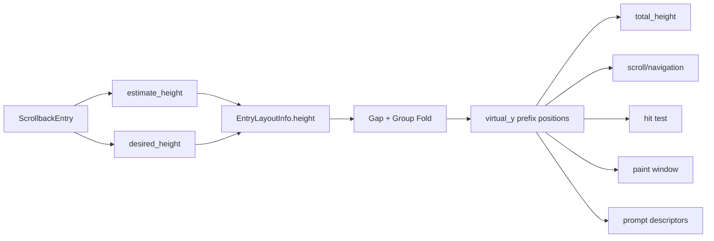

# 源码精读 03：`scrollback/state/layout.rs` 的惰性测量、虚拟坐标与绘制窗口

> 源码基线：Git `ed6d543`。目标文件：`crates/codegen/xai-grok-pager/src/scrollback/state/layout.rs`，基线共 3607 行。
>
> 本篇承接源码精读 02 的 `prepare_layout()`：上一篇说明什么时候进入完整、增量或稳定布局路径；本篇继续追踪这些路径怎样构建 Height、Gap、Virtual Y、Sticky Prompt、Scroll Anchor、Hit Test 与 Paint Window。

---

## 1. 这个文件真正解决的问题

Scrollback 可能有数万条 Entry、数十万行 Markdown，但屏幕一次只显示几十行。

布局系统必须同时做到：

- 知道整段历史大致有多高；
- 能快速滚到任意位置；
- 当前屏幕不能使用错误高度；
- Resize 后尽量看见原来的内容；
- Streaming 时不能每个 Chunk 重排完整历史；
- Sticky Prompt、Group Header 和 Mouse Hit Test 必须共享同一坐标模型。

## 2. 最关键的设计选择

源码没有精确渲染完整历史。

它采用：

```text
全历史廉价 Height Estimate
        +
当前视口附近 Exact Measurement
        +
估算被替换后重新计算 Virtual Y 并重新锚定
```

## 3. 文件骨架

| 基线行段 | 内容 |
| --- | --- |
| 1–101 | `ScrollAnchor`、`LayoutCache`、Y Lookup |
| 104–401 | Cache Accessor、Hit Test、Screen Area |
| 404–856 | Viewport、Anchor、Lazy Measurement、Eviction |
| 857–1179 | Sticky、Cache Build、Dirty Height、Virtual Y Patch |
| 1184–1447 | O(1) Append、Full Estimate Build、Gap Rule |
| 1450–1644 | Dense/Verb Group Range、Paint/Sticky Wrapper |
| 1648–1690 | Pure `compute_paint_window` Algorithm |
| 1692–3607 | 53 个 Unit Tests |

## 4. 推荐阅读顺序

不要从 Hit Test 开始逐行读。

建议顺序：

1. `LayoutCache` 字段；
2. `rebuild_layout_cache`；
3. `settle_visible_measurements`；
4. `rebuild_virtual_y_from_heights`；
5. `capture/restore_scroll_anchor`；
6. `compute_paint_window`；
7. Hit Test 与测试。

## 5. 一张数据流图



## 6. 先写下七个布局不变量

1. 所有 Cache Parallel Vec 的长度与 Entry 数一致；
2. `virtual_y[i]` 是 Entry i 的起始虚拟行；
3. `virtual_y[i+1] = virtual_y[i] + height[i] + gap_after[i]`；
4. Group Hidden Entry 的缓存高度可以是 0；
5. 当前视口内可绘制 Entry 最终必须 Exact；
6. `scroll_offset` 必须处于 `0..=max_scroll_offset`；
7. Paint Window 必须位于 `visible_range` 内。

## 7. Glossary checkpoint：布局基础

| 名词 | 白话解释 | 本文件中的实例 |
| --- | --- | --- |
| Layout | 内容在二维区域中的尺寸与位置 | Height、Y、Screen Rect |
| Virtual space | 不受屏幕高度限制的完整内容坐标系 | `virtual_y` |
| Viewport | 当前终端能看见的矩形窗口 | Width × Height |
| Measurement | 求某条内容渲染后占几行 | Estimate 或 Exact |
| Prefix position | 前面所有 Height/Gap 累加出的起点 | `virtual_y[i]` |
| Parallel vector | 相同下标描述同一对象的多个 Vec | Height、Measured、Virtual Y |

## 8. `ScrollAnchor` 为什么不是绝对 Row

Resize 会改变换行。

旧的第 800 个 Wrapped Row 在新宽度下可能对应完全不同的文字，因此绝对 `scroll_offset` 不是 Width-stable Bookmark。

## 9. Anchor 的三个字段

```rust
entry_idx: usize,
logical_line: usize,
sub_rows: i64,
```

- Entry Index 定位大块内容；
- Logical Line 用换行符分隔，通常不受 Wrap Width 影响；
- Sub Rows 表示该逻辑行内部或 Padding 附近的 Wrapped-row Offset。

## 10. 为什么 `sub_rows` 是有符号数

Anchor 可能落在 Logical Line Start 之前的 Vertical Padding，计算出的相对偏移可能为负。

用 `i64` 表达真实关系，再在恢复时 Clamp。

## 11. Anchor 的精度边界

如果 Anchor 所在逻辑行自身在新宽度下重新换行，Sub-row 不再完全 Width-stable。

源码把恢复位置限制在同一逻辑行的 Wrapped Extent 内，因此最多在该行内漂移，不会泄漏到下一逻辑行。

## 12. `LayoutCache` 的七组数据

| 字段 | 含义 |
| --- | --- |
| `entries` | 每条 Entry 的 Height、Gap、Group Flags |
| `entry_truncated_heights` | Prompt 折叠高度 |
| `measured` | 当前 Height 是 Exact 还是 Estimate |
| `virtual_y` | 每条 Entry 在完整内容中的起点 |
| `prompt_descriptors` | Sticky Prompt 输入 |
| `groups` | 最近 Fold Pass 的权威 Group Span |
| `width` | 这份 Cache 对应的终端宽度 |

## 13. 为什么 `measured` 独立保存

仅看 Height 数值无法知道它来自廉价估算还是精确 Markdown Render。

一个估算值偶然等于真实值，也仍需知道是否已经完成 Exact Measurement。

## 14. Truncated Height 为什么单独一个 Vec

正常 Height 用于内容布局；Truncated Height 只为 Sticky Prompt 的 `min_height` 服务。

把它从 `EntryLayoutInfo` 分离，避免所有普通 Entry 的通用结构承担仅 Prompt 消费的字段。

## 15. `groups` 为什么称为权威模型

Entry Layout 上的 Header/Hidden Flags 是 Group Pass 投影出的逐项标记。

`groups: Vec<GroupSpan>` 保存完整 Span 与 Kind，后续 Toggle、Paint Window 扩展应查询它，而不是重新猜测旧 Fold 结果。

## 16. Cache 的 Width 是 Validity Key

Height 与 Logical Row Mapping 都依赖 Width。

Entry Count 相同但 Width 不同，Cache 仍无效。

## 17. `LayoutCache::take()` 不是 `std::mem::take`

这是自定义方法：消费 Cache，清空所有 Vec，Width 归零，再把保留 Capacity 的 Cache 返回。

它用于 Full Rebuild 时复用 Allocation。

## 18. 为什么复用 Allocation

Resize 或 Display Toggle 可能频繁 Full Rebuild。

Vec Capacity 足够时清空再填充，可避免反复向 Allocator 申请相同规模内存。

## 19. Glossary checkpoint：缓存结构

| 名词 | 解释 | 实例 |
| --- | --- | --- |
| Cache validity | 缓存是否对应当前输入 | Width + Entry Count |
| Capacity reuse | 清元素但保留已分配空间 | `LayoutCache::take` |
| Exact flag | 标明值已经精测 | `measured[i]` |
| Projection | 从 Group Span 写入逐 Entry 标记 | Header/Hidden Flags |
| Conservative seed | 宁可多占空间也不覆盖内容的初始值 | Prompt Truncated Height = 6 |

## 20. `entry_at_content_y()` 的任务

给定完整虚拟内容中的绝对 Y 和合法 Entry Range，找出这一行落在哪条 Entry 内。

如果落在 Entry 之间的 Gap，返回 `None`。

## 21. 为什么使用 `partition_point`

`virtual_y` 单调不减，可以二分查找最后一个 `start_y <= content_y` 的 Entry。

成本 O(log n)，无需从头遍历历史。

## 22. `partition_point` 返回的是什么

Predicate 是 `y <= content_y`。

返回第一个 Predicate 为 False 的位置，因此候选 Entry 是它前一项。

## 23. 为什么还要检查 `entry_end`

二分只找到最近的起点。

如果 `content_y >= entry_start + height`，这一行位于该 Entry 后的 Gap，不应算命中。

## 24. Range 限制有什么用

Single Turn Mode 只允许当前 Turn 的 Entry 参与 Hit Test。

同一份全历史 Cache 可以配合不同 `visible_range` 使用，无需为每个 View Mode 建第二份 Cache。

## 25. `rebuild_layout()` 是强制重建入口

它：

1. 测试环境增加 Full Rebuild Counter；
2. 标 Structural Dirty；
3. 清 Layout Cache；
4. 已知 Width 时立即 Ensure Cache；
5. 重算 Total Height。

## 26. 为什么先置 None

`ensure_layout_cache` 的 Fast Path 只比较 Width 与 Entry Count。

原地 Display Mode 改变时这两项都可能不变，所以必须先清 Cache，强迫读取新 Height/Gap。

## 27. Cache Accessor 为什么返回 Option

Render 前未调用 `prepare_layout`，或 Mutation 刚使 Cache 失效时，布局数据不存在。

Option 让普通查询安全失败，而不是读取旧数据。

## 28. `group_spans()` 为什么返回空 Slice

它在 Cache Missing 时返回 `&[]`，让只读调用方不必分支处理 Option。

语义是“当前没有可依赖的 Fold Span”，不是“源码确定没有 Group”。

## 29. Hidden Selection 如何修复

若选中 Entry 被 Group Fold 设为 Height 0：

1. 先向前寻找最近 Height > 0 的项，通常是 Group Header；
2. 找不到再向后寻找；
3. 保证 Selection 指向可交互行。

## 30. 为什么优先向前

Truncation Header 通常位于被隐藏 Run 的第一项。

向前落到 Header，用户可以直接 Expand；向后可能跳出整个 Group。

## 31. `entries_in_range()` 为什么分配 Vec

底层是 `IndexMap`，给定 Index Range 的 Values 在 API 上不能直接借为普通 Slice。

函数收集引用，不 Clone Entry，但会分配引用 Vec。

## 32. Deprecated Wrapper 的作用

`entries_slice()` 保留旧调用兼容性并委托新名字。

Deprecated Attribute 提醒迁移，但不会立即破坏构建。

## 33. Glossary checkpoint：查询 API

| 名词 | 解释 | 实例 |
| --- | --- | --- |
| Hit test | 从屏幕坐标反查内容对象 | Row → Entry Index |
| Conservative fallback | 不确定时选择不隐藏/不命中危险状态 | Missing Cache 视为可见 |
| Deprecated | 仍可用但建议停止使用 | `entries_slice` |
| Allocation | 向内存分配器申请存储 | 收集引用 Vec |
| Sticky header | 滚动时固定在顶部的 Prompt | `StickyHeaderLayout` |

## 34. Screen Row Hit Test 的第一层边界

`entry_index_at_screen_row` 先检查 Row 是否位于 `scrollback_area`。

Rect 之外立即返回 None，避免后面的无符号坐标减法下溢。

## 35. Hit Test 的第二层：Sticky Zone

函数先计算当前 Sticky Layout。

如果 Row 落在 Header Rows 内，交给 `entry_at_header_row`，因为这里显示的是被推送或钉住的 Prompt，不一定等于普通内容坐标对应 Entry。

## 36. Hit Test 的第三层：坐标转换

普通内容 Row 转成绝对 Virtual Y：

```text
base_y of visible range
+ row relative to scrollback area
+ scroll_offset
```

再用二分查 Entry。

## 37. 为什么 Sticky Header 没有简单从 Y 中扣除

Header 可能覆盖或推动内容，且有 Pushed/Pinned 等状态。

源码把 Header Zone 作为独立绘制层先命中，再处理底下的内容空间。

## 38. `entry_screen_area()` 是反向映射

Hit Test 是 Screen Row → Entry。

`entry_screen_area` 则是 Entry → 当前屏幕可见 Rect，并同时报告顶部和底部是否被裁剪。

## 39. Selection Area 为什么来自 `HorizontalLayout`

Entry 的 Accent、Padding、Content Column 等横向规则由统一布局对象决定。

Selection Box 不应自行硬编码 X/Width，否则 Appearance 改变后会错位。

## 40. Sticky Prompt 的 Screen Area

如果目标 Entry 被 Sticky Layout 作为 Header 绘制，函数直接返回 Header Rect。

Pushed Prompt 的顶部可能逐行消失，因此 `top_clipped` 可为 True；Header 不会从底部裁剪。

## 41. 普通 Entry 如何判断不可见

设 Entry 区间为 `[entry_start, entry_end)`，Viewport 为 `[vp_start, vp_end)`。

若 `entry_end <= vp_start` 或 `entry_start >= vp_end`，两者不相交，返回 None。

## 42. 为什么累计坐标保持 `usize`

长历史可能超过 `u16::MAX`。

只有最终相对 Viewport 的 Screen Y/Height 才转换为 `u16`，因为它们已被裁剪到终端尺寸。

## 43. Header Overlay 的二次裁剪

普通 Entry 即使落在 Viewport，也可能完全位于 Sticky Header 后面。

函数计算 `content_top`，把 Rect 再裁到 Header 下方；若剩余高度为 0，返回 None。

## 44. `viewport_virtual_bounds()` 的坐标语义

它返回完整 Cache 空间中的 `(top, bottom)`，Bottom 是 Half-open Boundary。

Single Turn 时先取 `visible_range.start` 的 `base_y`，再加相对 Scroll Offset。

## 45. `max_scroll_offset()` 的公式

```text
total_height.saturating_sub(viewport_height)
```

内容不足一屏时自然得到 0；长内容时得到最后一屏顶部的位置。

## 46. Glossary checkpoint：坐标系

| 名词 | 解释 | 实例 |
| --- | --- | --- |
| Screen coordinate | 终端当前矩形内的位置 | `u16` Row/Y |
| Virtual coordinate | 完整历史中的位置 | `usize` Content Y |
| Base Y | 可见 Range 起点在全历史中的 Y | Single Turn 转换基准 |
| Half-open interval | 含起点、不含终点 | `[top, bottom)` |
| Clipping | 只保留和可见区域相交部分 | Entry Rect 裁剪 |
| Overlay | 一个图层覆盖另一个图层 | Sticky Header 覆盖内容 |

## 47. Capture Anchor 如何选择顶部 Entry

先得到 Viewport Top 的 Virtual Y，再调用 `entry_at_virtual_row`。

与 Hit Test 不同，这个函数把 Gap Row 归属给上方 Entry，从而保证 Gap 上 Resize 也有确定 Anchor。

## 48. 从 Wrapped Row 反解 Logical Line

对顶部 Entry 构造 `EntryRenderer`，调用：

- `logical_line_of_rendered_row`；
- `rendered_row_of_logical_line`。

两者把当前 Width 下的显示行映射到 Width-stable Logical Line。

## 49. 为什么 Rows 转 `u16` 时有饱和回退

`u16::try_from(rows_into_entry).unwrap_or(u16::MAX)` 防止极端超高单 Entry 转换 Panic。

超过范围时把定位压到可表达的最大行，而不是中止 UI。

## 50. Restore Anchor 如何在新宽度重定位

它重新渲染 Entry 的 Logical Line Start Rows，找到 Anchor Logical Line 在新 Width 下的起点和末行。

随后把旧 `sub_rows` 加上去并 Clamp 在该逻辑行范围内。

## 51. Anchor Restore 的最后一步

```text
new_top_content_y = entry_y + new_rows_into_entry
scroll_offset = new_top_content_y - visible_range_base_y
```

然后 Clamp 到 `max_scroll_offset`。

## 52. Entry 删除时 Anchor 会怎样

Anchor 保存的是 Entry Index，不是 Entry ID。

它专门用于 Width Rebuild 前后、内容序列不变的短事务，不是跨任意内容 Mutation 的持久书签。

## 53. 为什么这里使用 Index 是合理的

Anchor Capture 与 Restore 发生在同一个 `prepare_layout` Width-change 分支中，中间只重建 Cache，不重排 Entries。

作用域受控时，Position 比 ID 再 Lookup 更直接。

## 54. Measurement Window 从哪里开始

从 `first_visible_entry()` 开始。

故意没有 Above Margin：测量顶部 Entry 之前的估算项会改变它的累计 Y，而 Scroll Offset 不变时屏幕内容就会跳。

## 55. Measurement Window 在哪里结束

找到 Start Y 小于 Viewport Bottom 的最后 Entry，再向下扩 `MEASURE_MARGIN_ENTRIES`。

基线常量是 8 个 Entry。

## 56. 为什么 Margin 按 Entry 而不是 Row

它是低成本预读缓冲，目的是减少小幅向下滚动立即触发测量。

不是严格“一屏高度”的保证；Entry 高度分布不均时覆盖 Row 数会不同。

## 57. `entry_index_in_viewport()` 为什么 Fail Open

Cache Missing 或 Measurement Window 无法推导时返回 True。

它主要用于 Animation Gating；不确定时宁可多 Redraw，也不能把恢复状态所需动画错误静音。

## 58. Scroll Offset 卡在内容末尾之后时为何也返回 True

Content Shrink 后可能短暂出现 `scroll_offset >= total_height`。

把它视为无可信 Window，让 Redraw/Prepare 有机会修复，而不是进入“没有 Entry 需要动画”的死状态。

## 59. Off-screen Render Cache Eviction 解决什么

每个已经 Render 的 Markdown Entry 可能保存 Styled/Wrapped Output。

多 MB Transcript 的全部 Render Cache 可占数百 MB，而绝大多数离 Viewport 很远。

## 60. Eviction 保留哪些区域

以 Measurement Window 为中心，前后再保留 `EVICT_KEEP_MARGIN_ENTRIES = 128`。

Selected Entry 即使在远处也不驱逐，因为 Copy/Selection 可能读取它。

## 61. Eviction 为什么不破坏 Scroll Geometry

它只丢 Heavy Render Output。

Height Estimate、Truncated Height 和 Layout Cache 仍保留；Entry 滚回附近时可透明重新 Render。

## 62. Glossary checkpoint：惰性工作与内存

| 名词 | 解释 | 实例 |
| --- | --- | --- |
| Lazy measurement | 用到附近内容时才精测 | Viewport Window |
| Look-ahead margin | 多处理一点即将进入视口的内容 | 下方 8 Entry |
| Fail open | 不确定时允许操作继续 | Animation 视为可见 |
| Eviction | 丢弃可重建的缓存以释放内存 | Off-screen Render Cache |
| Geometry | 内容尺寸和位置关系 | Height、Virtual Y |
| Heavy cache | 重建贵但可丢弃的大对象 | Styled/Wrapped Markdown |

## 63. Width Helper 为什么集中

`entry_area_width()` 通过 `HorizontalLayout` 计算传给 `EntryRenderer` 的完整 Entry 区域宽度。

Reveal Row Mapping、Exact Height 和 Prompt Descriptor 都使用同一 Helper，避免各自扣 Padding 后漂移。

## 64. Text Column Width 与 Entry Area Width 的区别

`entry_text_column_width()` 排除 Accent Bar 和 Block Padding，供 Inline Edit Textarea 使用。

Renderer Area Width 仍包含由 Renderer 自己处理的 Chrome。

## 65. Exact Measurement 的预扫描

`measure_window_exact` 先检查窗口中是否存在：

- 尚未 Measured；
- Height 不为 0；
- 不是 Synthetic Group Header。

全部无需测量时，不创建 Theme 和 Layout Context。

## 66. 为什么 Hidden Entry 不精测

Height 0 是 Group Fold 的显示结果。

它不绘制 Markdown，精测原始内容反而会覆盖 Fold Pass 对高度的权威决定。

## 67. 为什么 Group Header 不精测

Header 是 Fold Pass 合成的一行，不是 Entry 原始 Markdown 的 Natural Height。

其高度由 Group Layout 拥有。

## 68. Inline Edit Height 如何接管测量

若当前 Entry ID 匹配 `inline_edit_height`，使用 Textarea 实际高度；否则调用 Renderer `desired_height`。

这保证编辑器占用空间和下方 Entry Position 一致。

## 69. 为什么只有 Prompt 额外算 Truncated Height

这个值只参与 Sticky Prompt Minimum Height。

普通 Entry 即使支持 Fold，也不需要为 Sticky 算法支付第二次 Render 成本。

## 70. `measured` 的单调性

一次 Cache 生命周期内，Entry 通常从 False 变 True，不会由 Exact 退回 Estimate。

Width Change 会创建新 Cache，重新把全量标成 False。

## 71. `settle_visible_measurements()` 为什么循环

一批 Estimate 变 Exact 后，后续 Entry 的 Y 会移动，Viewport Bottom 可能暴露新的未测 Entry。

所以“测一次当前窗口”不一定已经稳定。

## 72. 循环为什么能终止

每次成功测量至少一个此前 False 的 Entry，Measured Set 单调增长。

源码仍设置 `entries.len() + 2` 的防御上限，避免意外逻辑变化造成无限循环。

## 73. 每轮 Settle 后做什么

1. 重建 Gap、Group 和 Virtual Y；
2. 重算 Total Height；
3. Follow Mode 重新贴精确底部；
4. 非 Follow Mode 保持顶部，只在内容缩短越界时 Clamp。

## 74. 为什么没有 Above Margin 是保持顶部的关键

非 Follow Mode 下，测量窗口从第一可见 Entry 开始。

其上方所有 Estimate 不变，所以第一可见 Entry 的累计起点不变，原 Scroll Offset 仍对应原顶部内容。

## 75. Bottom-pinned 的锚定策略

Follow Mode 不试图保持顶部。

Exact Height 改变 Total 后，调用 `follow_scroll_to_bottom()`，让最后一屏仍贴在内容末尾。

## 76. Glossary checkpoint：收敛算法

| 名词 | 解释 | 实例 |
| --- | --- | --- |
| Settle | 反复精测并更新位置直到视口稳定 | `settle_visible_measurements` |
| Monotonic progress | 每轮都向终态单向推进 | Measured False→True |
| Defensive cap | 理论可终止仍设置最大轮数 | `len + 2` |
| Top anchoring | 保持视口顶部内容不动 | Manual Scroll |
| Bottom pinning | 内容变化后保持最后一屏贴底 | Follow Mode |

## 77. Warm Above 解决什么体验问题

Resume 后通常位于底部。

如果用户第一下向上滚才测量上方 Estimate，位置可能突然修正。Warm-up 提前精测底部上方若干页。

## 78. Warm-up 的安全前提

只在：

- Follow Mode；
- 非 `follow_preserve_scroll`；
- Viewport 与 Width 非零；
- 能解析当前顶部 Entry。

这些条件下测量上方导致的统一位移可通过重新贴底抵消。

## 79. 为什么 Preserve Mode 禁止 Warm-up

Preserve Mode 暂时把 Prompt 固定在顶部，同时保持 Follow Policy。

测量顶部以上内容会把它向下推，而重新贴底逻辑此时刻意保留该位置，造成可见跳动。

## 80. Warm 范围有多大

`RESUME_WARM_PAGES = 3`，用三倍 Viewport Height 向上计算 Virtual Y，再映射为 Entry Range。

它按页面 Row 尺度，而 Measurement Margin 按 Entry 数。

## 81. `entry_at_virtual_row()` 与 Hit Test 的 Gap 差异

它返回“最后一个起点不晚于 Row 的 Entry”，不再检查 Row 是否落在 Gap。

适合 Anchor 与测量范围，因为这些操作需要任何 Virtual Row 都有确定邻接 Entry。

## 82. `measure_span_and_rebuild()` 的职责

它把目标范围 Clamp 到当前 Visible Range，精测尚未测量项；若有变化，重建 Virtual Y 并重算 Total。

它不自动改变 Scroll Offset，调用方必须选择合适 Anchor 策略。

## 83. `measure_around_entry()` 的有界窗口

以目标 Entry 为中心，前后各扩 `viewport_height` 个 Entry。

每条可见 Entry 至少一行，因此这个 Entry 数界足以覆盖任何一屏可能需要的邻域，且不扩到全历史。

## 84. 为什么 On-screen Selection 不应随意向上测量

如果 Selection 已完全可见，测量它上方的 Estimate 会改变其 Virtual Y；导航函数可能因“已可见”提前返回，不重新算 Scroll，导致跳动。

所以调用合同要求这种路径只为 Off-viewport Target 测量。

## 85. Single Turn 的特殊测量

`measure_scroll_target()` 除目标附近外，还精测 Visible Range Start 的 Prompt。

该 Prompt 可能离目标很远，却决定 Sticky Header Height，仍会影响 Scroll Math。

## 86. Prompt 何时 Pin

`pinned_prompt_index()` 要求：

- 存在 Current Turn；
- Prompt 在 Visible Range；
- Prompt 正是 Range Start；
- `scroll_offset > 0`。

## 87. `scroll_info()` 为什么返回混合整数类型

Scroll Offset 和 Total Height 是 `usize`，支持超过 65535 行；Viewport Height 保持 `u16`，对应终端实际尺寸。

## 88. `invalidate_layout_cache()` 的强失效

它清 Cache、把所有 Entry ID 加入 Dirty Heights，并标 Structural Dirty。

下一次 Prepare 不能走局部 Streaming Fast Path。

## 89. `ensure_layout_cache()` 的 Fast Path

Cache 存在、Width 相同、Entry Count 相同时直接返回。

因此调用方若做原地 Display Mutation，必须显式清 Cache 或走正确 Dirty Path。

## 90. Glossary checkpoint：导航相关布局

| 名词 | 解释 | 实例 |
| --- | --- | --- |
| Scroll target | 希望定位到的 Entry | Top/Center Navigation |
| Sticky input | 决定顶部 Header 的布局数据 | Prompt Descriptor |
| Visible range | 当前 View Mode 允许显示的 Entry 区间 | All/Single Turn |
| Strong invalidation | 放弃整份 Cache | `invalidate_layout_cache` |
| Fast path | 输入未变时跳过昂贵工作 | Width + Count Match |

## 91. Total Height 为什么只求 Visible Range

Single Turn Mode 不应允许用户滚进其他 Turn。

Cache 保留全历史位置，但 `total_height` 只累加当前 Projection 的 Layout Slice。

## 92. Trailing Gap 为什么计入 Total

最后一条 Entry 的 `gap_after` 固定为 1，为 Selection Box 底角留空间。

因此求和无需最后再减一。

## 93. Dirty Height Update 怎样处理 Borrow

先从 Dirty ID Set 收集 `(EntryId, Index)`，再 Mutable Borrow Cache。

这样避免一边持有 Cache Mutable Borrow，一边通过整个 State 做复杂 Lookup 的借用冲突。

## 94. Dirty ID 已删除怎么办

`filter_map(get_index_of)` 会跳过不存在的 ID。

缓存长度也有防御检查，避免 Cache 与 Entries 短暂不同步时越界。

## 95. Dirty Entry 为什么总标 Exact

Update 使用 `desired_height` 重新测量，所以无论 Height 数值是否变化，`measured[idx]` 都可置 True。

## 96. Prompt Height 不变也要刷新 Truncated Height

初建时 Prompt Truncated Height 使用保守最大值 Seed。

Natural Height 可能刚好没变，但 Sticky Minimum 仍需要从 Seed 更新为精确值。

## 97. Changes Vec 保存什么

只保存 Height 真正变化的 `(index, new-old delta)`。

空 Vec 不等于“没有执行测量”，只表示 Geometry Height 没发生数值变化。

## 98. Full Virtual Y Rebuild 的步骤

1. 重算 Pairwise Gap；
2. 重跑 Verb/Dense Group Fold；
3. 清 Virtual Y 与 Prompt Descriptors；
4. 从 0 累加 Height + Gap；
5. 重建 Prompt Descriptor。

## 99. 为什么 Height Rebuild 还要重跑 Group

调用它的 Structural Path 可能伴随 Display Mode、Pending Input 或 Group Membership 变化。

Group Pass 会把某些 Height 改为 0 或 Header Height，因此必须在累加 Y 之前完成。

## 100. Incremental Patch 的适用前提

`patch_virtual_y_for_dirty` 只适用于 Height-only Mutation，Gap 与 Group Structure 确定不变。

调用者在 `prepare_layout` 用 `gaps_may_be_dirty == false` 守住这个前提。

## 101. 为什么从最早变化项之后开始移动

Entry i 的 Height 改变，不影响它自己的 Start Y，只影响 i+1 以及后续 Entry。

尾部最后一项变化时，没有后续 Virtual Y 要更新。

## 102. 多个 Dirty Entry 如何累计 Delta

Changes 先按 Index 排序。

遍历后续 Virtual Y 时维护 Cumulative Delta；经过每个变化点后，把该变化加入后续位置的位移。

## 103. 为什么内部位移用 `i64`

Height 可以变大也可以变小，Delta 是有符号数。

在合法 Layout 下最终 Y 不应为负；算法依赖调用前几何一致性，而不是每步 Saturating。

## 104. Prompt Descriptor 也必须 Patch

后方 Prompt 的 `y_virtual` 随前面 Height Delta 平移；Dirty Prompt 自己的 `full_height` 也要刷新。

只修 `virtual_y` 会让 Sticky 逻辑和内容坐标分叉。

## 105. Tail Streaming 为什么接近 O(1)

若唯一变化是最后一条 Entry Height：

- Exact Remeasure 只处理一项；
- `virtual_y[earliest+1..]` 为空；
- Total Height 直接加 Delta。

这避免每个 Token 扫完整历史。

## 106. Glossary checkpoint：增量算法

| 名词 | 解释 | 实例 |
| --- | --- | --- |
| Delta | 新值减旧值的变化量 | Height Delta |
| Cumulative delta | 到当前位置为止的变化量之和 | 后续 Y Shift |
| Earliest dirty | 最靠前的变化位置 | Patch 起点 |
| Height-only mutation | 只改变尺寸、不改变分组关系 | 尾部 Streaming |
| O(1) tail update | 历史增长时工作量近似固定 | 最后一项变高 |

## 107. Append Fast Path 为什么重要

Heavy Subagent Streaming 可能每秒 Push 多个 Block。

每次 Push 都 Full O(n) Rebuild，会让全屏滚动降到个位数 FPS；`extend_layout_cache_with_new_entry` 专门避免这一退化。

## 108. Append Fast Path 的前置一致性检查

要求 Cache 的：

- Entry Layout Length；
- Virtual Y Length；
- Truncated Height Length；
- Measured Length；

都等于新 Entry Index，并确认 Index 在 Entries 内。

## 109. 检查失败为什么返回 False

函数不尝试修补未知错位。

调用方收到 False 后使整个 Cache 失效，下一 Prepare 走安全 Full Build。

## 110. 新 Entry 为什么立即 Exact

Append 通常发生在底部可见或 Streaming 区域。

函数直接调用 `desired_height`，并把 `measured` 设 True，避免刚追加又进入 Lazy Measurement。

## 111. 为什么要重算前一项 Gap

旧最后一项此前固定有 Trailing Gap 1。

追加后它与新 Entry 之间应遵守 Pairwise Group Rule，可能变成 0。

## 112. 新 Entry 的 Y 怎样得到

```text
prev.virtual_y + prev.height + recomputed prev.gap_after
```

无需修改更早 Entry 的 Y。

## 113. 新 Prompt 还要追加什么

计算 Exact Truncated Height，并建立 Prompt Descriptor：Index、Virtual Y、Full Height、Min Height、Sticky Flag。

Expanded Foldable Prompt 不 Sticky，但仍参与 Push Calculation。

## 114. 为什么 Fast Path 不更新 Total Height

下一次 `prepare_layout` Case 3 会根据当前 `visible_entry_range` 求和。

在 Append 函数里直接加高度容易忽略 Single Turn Projection 与前一 Gap 变化。

## 115. Full Rebuild 的 Pass 1

对每条 Entry 调 `estimate_height`，不做完整 Markdown Render/Wrap。

同时写入默认 Gap 1、无 Group Flags、Measured False。

## 116. Prompt Truncated Height 为什么 Seed 为 6

`MAX_TRUNCATED_HEADER_HEIGHT = 6`。

未精测 Prompt 时宁可 Sticky Header 多预留，也不能少预留导致 Header 覆盖正文。

## 117. Full Rebuild 的 Pass 2

`recompute_gap_after` 根据相邻可见 Entry 的 Groupable/Collapsed 状态计算 Gap。

随后 `groups::apply` 执行 Verb Group Folding 与 Group Truncation。

## 118. Full Rebuild 的 Pass 3

从 Y=0 遍历 Layout：先 Push 当前 Y，再累加当前 Height 与 Gap。

遇到 User Prompt 同时建立 Sticky Descriptor。

## 119. 为什么 Full Build 是 O(history) 但仍可接受

它仍需遍历所有 Entry 建几何骨架，但每项只做廉价估算和整数运算。

昂贵的 Markdown Exact Render 限制在 Viewport Window。

## 120. Glossary checkpoint：多阶段构建

| 名词 | 解释 | 实例 |
| --- | --- | --- |
| Pass | 对数据的一次完整遍历 | Estimate、Gap、Prefix Y |
| Cheap arithmetic | 不做昂贵渲染的整数计算 | Virtual Y 累加 |
| Conservative reservation | 先多留空间避免覆盖 | Prompt Seed 6 |
| Fallback rebuild | 增量条件不成立时完整重建 | Append 返回 False |
| Allocation reuse | 重建时复用 Vec Capacity | Cache `take()` |

## 121. Pairwise Gap Rule

两条相邻可见 Entry 同时满足：

- 都是 Groupable；
- 都处于 Collapsed；

则 Gap 为 0，否则为 1。

## 122. Hidden Thinking 为什么透明

隐藏 Thinking 自己 Height 0、Gap 0。

前一可见 Entry 计算邻居时跳过连续 Hidden Thinking，直接观察下一可见 Entry，防止留下双重空白。

## 123. 最后一项为什么永远 Gap 1

即使末尾跟着只被隐藏的 Thinking，最后一个可见 Entry 也保留 Trailing Space。

这为 Selection Border Bottom Corner 等视觉元素留行。

## 124. Dense Group Range 怎样确定

从目标 Index 向前、向后寻找连续 `joins_dense_run` 项。

非 Groupable 或在 Collapsed-only 模式下不折叠的 Entry，返回 Singleton Range。

## 125. Verb Group 为什么优先

若目标属于最后 Fold Pass 产生的 Verb Group Span，`group_range_of` 直接返回该 Span。

避免把 Verb Tool Run 与更宽泛的 Dense Group 规则混在一起。

## 126. `joins_dense_run()` 的共享价值

Group Range 和 Expand-all 等重新推导路径共享同一个 Membership Predicate。

否则不同操作可能对“Group 从哪到哪”给出不同答案，用错 Header ID。

## 127. Span Query 与预测 Walk 的区别

- Post-layout Query 使用 `verb_group_span_range`，读取最后 Fold Pass 的权威 Span；
- Mid-mutation Query 使用 `verb_group_range_of`，根据当前 Entry State 预测下一 Fold。

一个回答“现在画的是什么”，一个回答“下一次会折成什么”。

## 128. Thinking 在 Verb Run 中可能是 Transparent

`run_step` 区分 Member、Thought Member、Transparent、Break。

Transparent Entry 可位于扫描跨度中但不属于 Toggle Unit；Break 则终止 Run。

## 129. Glossary checkpoint：分组

| 名词 | 解释 | 实例 |
| --- | --- | --- |
| Dense run | 连续可紧密显示的一段 Entry | Collapsed Groupable Blocks |
| Verb run | 同类 Tool Verb 形成的折叠段 | Read/Search 等聚合 |
| Group span | Fold Pass 产出的权威区间 | `GroupSpan` |
| Transparent member | 扫描可跨过但不归组的 Entry | 某些 Thinking 状态 |
| Break | 终止连续 Run 的 Entry | 不兼容 Tool/状态 |
| Singleton range | 只有目标自身的区间 | `idx..idx+1` |

## 130. Paint Window 为什么是独立概念

Visible Range 可能是完整历史或整个 Turn，仍然很大。

Paint Window 只保留当前 Viewport 真正可能相交的 Entry，Render Loop 不必扫描所有可见历史。

## 131. `compute_paint_window` 为什么是纯函数

它只接受 Virtual Y、Layouts、Visible Range、Scroll、Viewport Height 和 Run-end Callback。

不依赖完整 State，容易构造小数组做边界测试。

## 132. Paint Start 怎样二分

先找第一个 `virtual_y >= viewport_start` 的 Entry。

如果前一 Entry 的 End 超过 Viewport Start，说明它从上方跨入屏幕，需要把 Start 回退一项。

## 133. 为什么最多回退一项

Entry 的纵向区域不重叠。

Viewport Top 最多位于一条前置 Entry 内，不可能同时被两条普通 Entry 跨越。

## 134. Paint End 怎样二分

找所有 Start Y 小于 `viewport_end` 的 Entry。

Half-open 规则保证刚好从 Viewport Bottom 开始的 Entry 不绘制。

## 135. Group Header 为什么延伸 Window

Header Label 可能需要统计整个 Off-screen Run 的数量、时态或失败状态。

如果只把屏幕内 Header 传给 Renderer，它看不到屏幕外 Members，聚合摘要会错误。

## 136. 延伸为何仍 Clamp 到 Visible Range

Group Span 推导可能是全历史坐标。

Single Turn Render 不能因为 Header 聚合越过当前 Projection，故 `min(visible_range.end)`。

## 137. `content_y0` 是什么

它是 Paint Window 第一项相对 Visible Range Base 的 Virtual Y。

Renderer 用它作为局部绘制起点，无需重新从 Range Start 累加前面所有 Entry。

## 138. Empty Paint Window 的返回

返回空 Range 和 `content_y0 = 0`。

例如 Scroll 已在内容末尾之外，或 Visible Range 本身为空。

## 139. Wrapper 为什么声明可能 Panic

`ScrollbackState::paint_window` 用 `expect` 要求 Layout Cache 已准备，并假定 Range 合法。

这是 Render Pipeline 内部合同；普通交互查询更多使用 Option 保守失败。

## 140. Glossary checkpoint：窗口化绘制

| 名词 | 解释 | 实例 |
| --- | --- | --- |
| Windowing | 只处理巨大数据中当前需要的一段 | Paint Window |
| Straddle | Entry 从视口上方跨入屏幕 | Start 回退一项 |
| Aggregated header | 摘要多个 Member 的合成行 | Group Header |
| Run-end callback | 查询 Header 所属 Span 末尾 | `run_end(i)` |
| Local origin | 子窗口相对完整空间的起点 | `content_y0` |

## 141. Sticky Layout Wrapper 做什么

`sticky_layout()` 检查 Entries、Width、Viewport 非空，Ensure Cache，再把全历史 Prompt Descriptor 转换为当前 Visible Range 的相对描述，调用 `compute_sticky_layout`。

没有 Header 时返回 None。

## 142. 为什么 `sticky_layout()` 需要 `&mut self`

它可能通过 `ensure_layout_cache` 构建缺失 Cache。

即使最终只是查询 Header，Lazy Cache Population 仍是 Mutation。

## 143. Prompt Descriptor Getter 为什么 Clone Vec

方法可能先 Mutable Ensure Cache，之后返回 Owned Clone，避免把内部 Cache Borrow 暴露给调用方后限制 State 的后续使用。

代价是一次 Descriptor Vec Copy。

## 144. 测试整体分组

53 个测试大致覆盖：

- Append Fast Path；
- Binary-search Hit Test；
- Sticky Header/Screen Area；
- Lazy Measurement Bound；
- Resize Anchor；
- Long Session；
- Navigation/Fold Settlement；
- Paint Window 与 Group Extension。

## 145. Append Fast Path 测试固定什么

前三组测试确认：

- Push 后保留并扩展现有 Cache；
- 成功扩展后不误标 Structural Dirty；
- 新 Entry Virtual Y 正确；
- User Prompt 同步增加 Descriptor。

## 146. `entry_at_content_y` 测试固定什么

覆盖普通 Height、单 Entry、受限 Range、空 Range、Height=1，以及 Gap Row 返回 None。

这是二分边界最容易出现 Off-by-one 的区域。

## 147. Hit Test 测试固定什么

分别验证：

- 无 Scroll/无 Header；
- Sticky Header Rows 不当作底层 Content；
- Entry Screen Area 被 Header 裁剪；
- 完全藏在 Header 后返回 None。

## 148. FFmpeg Mid-session 测试的意义

`ffmpeg_install_midsession_expands_video_reservation` 模拟环境能力变化后 Poster Reservation 增高。

它证明 Layout Cache Key 不只有显式 State 字段，还包含被 Snapshot 监控的外部环境。

## 149. Lazy Bulk Load 测试固定什么

长历史初建时，Exact Layout Count 应与 Viewport 加 Warm Band 有界相关，而不是等于历史长度。

这保护“全量估算、局部精测”的核心性能合同。

## 150. Resize Deferral 测试固定什么

两项测试区分 Frame Boundary 与多次 `prepare_layout` Call。

同一 Frame 的额外 Layout Pass 不能提前运行 Warm Above；下一 Frame 才能 Armed。

## 151. Scroll-up On-demand 测试固定什么

用户滚入此前 Estimated 区域后，新 Viewport Entry 会被精测。

第二次相同 Prepare 应成为 No-op，说明 Measured 状态稳定且不会重复渲染。

## 152. Total Height Oracle 测试固定什么

测试把 Lazy 结果与独立 Exact Oracle 对比，确认逐步精测后 Total Height 内部一致并最终精确。

Oracle 不复用被测算法，才有交叉验证价值。

## 153. Scroll Target 测试固定什么

Center、Top、Bottom 导航测试确保目标周围先精测，再使用新 Virtual Y 计算 Offset。

顺序反过来会用 Estimate 定位，随后 Exact Measurement 又把目标推走。

## 154. Resize Anchor 测试固定什么

覆盖变窄、变宽、Follow 贴底、Anchor Line 重换行时 Sub-row Clamp，以及 Viewport Top 落在 Gap Row 的归属。

它们把 Anchor 的设计注释变成可执行合同。

## 155. 超过 `u16::MAX` 的测试

`goto_bottom_reaches_end_past_u16_max_rows_gb3236` 构造超长内容，验证 Scroll Offset 能到达 65535 行之后。

这是选择 `usize` 累计坐标的直接回归证据。

## 156. Fold 与 Selection 测试固定什么

测试检查 Estimated Session 中 Fold 后不跳、Selection 可见性调整有界、Single Turn Center 会额外测 Sticky Prompt。

这些用例强调“测量正确”还不够，用户视点也要稳定。

## 157. Paint Window 测试固定什么

覆盖：

- Top Straddle 回退；
- Scroll 超过内容得到 Empty；
- Empty Visible Range；
- Verb Header 延伸到 Run End；
- Truncation Header 延伸；
- State Wrapper 包含 Off-screen Group Members。

## 158. Glossary checkpoint：测试思想

| 名词 | 解释 | 实例 |
| --- | --- | --- |
| Oracle | 独立实现的正确答案 | Exact Total Height |
| Off-by-one | 边界多一或少一项 | Half-open Viewport |
| Regression | 防止已知缺陷重现 | `gb3236` 超长滚动 |
| Bounded work | 工作量被 Viewport 限制 | Lazy Measurement Count |
| No-op stability | 第二次相同操作不再改变状态 | Second Prepare |

## 159. 常见错误一：把 Estimate 当 Exact

若忘记 `measured` Flag，Render 可能依据错误 Height 裁剪或 Hit Test。

数值碰巧相等不能代替来源状态。

## 160. 常见错误二：测量窗口加 Above Margin

看似更积极预取，却会改变第一可见 Entry 之前的累计高度。

Manual Scroll Offset 不同步调整时，屏幕会跳。

## 161. 常见错误三：只修 Virtual Y

Height Delta 还会影响 Prompt Descriptor Y/Full Height、Total Height、Follow Pin。

Parallel Derived State 必须一起更新。

## 162. 常见错误四：Append 时忘记前一 Gap

旧尾项的 Gap 是 Trailing Rule；成为中间项后应服从 Pairwise Rule。

少这一步会让新 Entry Y 多一行或少一行。

## 163. 常见错误五：Paint Window 丢掉 Off-screen Group Member

视觉上 Member 不在屏幕内，但 Header 的聚合文字依赖它们。

Windowing 不能只考虑像素相交，还要考虑语义依赖。

## 164. 常见错误六：把所有坐标都压成 `u16`

Screen Rect 适合 `u16`，完整历史位置不适合。

过早转换会截断超长会话，使底部永久不可达。

## 165. 新布局特性 Review Checklist

1. 它影响 Estimate、Exact，还是两者？
2. Width/CWD/Appearance 是否是新 Cache Key？
3. Hidden/Header Height 的所有权属于 Renderer 还是 Group Pass？
4. Virtual Y 与 Prompt Descriptor 是否一起更新？
5. Manual Top Anchor 和 Follow Bottom Pin 是否都稳定？
6. Hit Test 与 Screen Area 是否共享坐标规则？
7. Paint Window 是否有屏幕外语义依赖？
8. 工作量是否仍受 Viewport 限制？

## 166. 推荐的第一条跟读路线

```text
prepare_layout (mod.rs)
  -> ensure_layout_cache
  -> rebuild_layout_cache
  -> settle_visible_measurements
  -> measure_window_exact
  -> rebuild_virtual_y_from_heights
```

目标：理解首次显示长历史。

## 167. 推荐的第二条跟读路线

```text
push (mod.rs)
  -> extend_layout_cache_with_new_entry
  -> prepare_layout Case 3
  -> compute_total_height_from_cache
```

目标：理解新 Block Append 为什么不 Full Rebuild。

## 168. 推荐的第三条跟读路线

```text
push_chunk_to_agent (mod.rs)
  -> update_dirty_entry_heights
  -> patch_virtual_y_for_dirty
  -> settle_visible_measurements
```

目标：理解尾部 Streaming O(1) Fast Path。

## 169. 推荐的第四条跟读路线

```text
capture_scroll_anchor
  -> logical_line_of_rendered_row
  -> width rebuild
  -> rendered_row_of_logical_line
  -> restore_scroll_anchor
```

目标：理解 Resize 稳定视点。

## 170. 手工实验一：观察 Lazy Measurement

建立 1000 条会换行的 Entry，第一次 Prepare 后统计 `measured == true` 数量。

向上滚一页再次统计；应只增加新 Viewport 附近项，而不是瞬间变成 1000。

## 171. 手工实验二：破坏 No-above-margin

在临时分支把 Measurement Start 向前扩几十项，再构造 Estimate 与 Exact 差异大的内容。

Manual Scroll-up 时观察顶部 Entry 是否跳动。实验后恢复修改。

## 172. 手工实验三：画出 Virtual Y

用三条 Height `[2, 3, 1]`、Gap `[1, 0, 1]` 手算：

```text
virtual_y = [0, 3, 6]
total     = 7
```

再把第二条 Height 增加 2，验证第三条 Y 变为 8，而第二条起点保持 3。

## 173. 手工实验四：Paint Window Straddle

让第一条 Entry Height 大于 Viewport，Scroll 到它中部。

`partition_point` 初始位置可能落到下一项，回退逻辑应把跨越顶部的第一条重新纳入。

## 174. 阅读后应该能回答的问题

1. 为什么全历史只做 Estimate？
2. 为什么 Measurement Window 没有 Above Margin？
3. Anchor 为什么保存 Logical Line？
4. `entry_at_content_y` 与 `entry_at_virtual_row` 如何处理 Gap？
5. Streaming 尾项变高为什么接近 O(1)？
6. Prompt Descriptor 为什么属于 Layout Cache？
7. Group Header 为什么扩大 Paint Window？
8. 哪些坐标必须使用 `usize`？

## 175. 本篇最终心智模型

把这套布局看成一张逐步校准的地图：

- Estimate 先画出整片大陆；
- Virtual Y 提供可二分的道路里程；
- Viewport Exact Measurement 校准脚下区域；
- Anchor/Bottom Pin 吸收校准产生的位移；
- Paint Window 只派 Renderer 去当前可见区域；
- Group 与 Sticky 作为语义图层修正纯几何裁剪。

## 176. 本篇 Glossary

| 名词 | 白话解释 | 本篇对应物 |
| --- | --- | --- |
| Layout Cache | 保存高度与位置的派生状态 | `LayoutCache` |
| Entry Layout | 单条 Entry 的高度、间隙和组标记 | `EntryLayoutInfo` |
| Estimate | 不完整渲染的廉价高度 | `estimate_height` |
| Exact Measurement | 根据真实 Markdown Wrap 的高度 | `desired_height` |
| Measured Flag | 标明 Height 是否精确 | `measured` |
| Virtual Y | Entry 在完整内容中的起始行 | `virtual_y` |
| Prefix Sum | 按顺序累计前项尺寸 | Height + Gap |
| Gap After | Entry 之后的空白行数 | 0 或 1 |
| Visible Range | 当前 View Mode 的 Entry 区间 | All Turn/Single Turn |
| Viewport | 当前屏幕窗口 | Scroll Offset + Height |
| Hit Test | 屏幕坐标反查 Entry | `entry_index_at_screen_row` |
| Screen Area | Entry 当前占据的屏幕 Rect | `entry_screen_area` |
| Clip | 截掉不可见部分 | Top/Bottom/Header Clip |
| Sticky Prompt | 滚动时留在顶部的用户 Prompt | Prompt Descriptor 输入 |
| Scroll Anchor | Resize 前后稳定内容位置的书签 | Entry + Logical Line + Sub Rows |
| Logical Line | 由换行符分隔、不依赖 Wrap 的行 | Anchor 中间坐标 |
| Wrapped Row | 受终端宽度影响的显示行 | Renderer 输出 |
| Settle | 反复精测直到视口稳定 | Lazy Measurement Loop |
| Warm Above | 提前精测底部上方数页 | Resume 优化 |
| Measurement Window | 当前需精测的 Entry 范围 | Viewport + 下方 8 项 |
| Eviction | 丢弃远处可重建缓存 | Render Cache Sweep |
| Height Delta | 新旧高度差 | Incremental Patch 输入 |
| Paint Window | 本帧真正交给 Renderer 的子范围 | `compute_paint_window` |
| Straddle | Entry 跨过 Viewport 边界 | Paint Start 回退 |
| Group Span | 聚合/折叠 Run 的权威区间 | Dense/Verb Group |
| Conservative Seed | 未精测时不会少占空间的初值 | Truncated Height 6 |
| Fail Open | 不确定时允许 Redraw | Animation Gating |

## 177. 源码定位表

| 主题 | 基线行段 | 首选符号 |
| --- | --- | --- |
| Anchor/Cache | 9–101 | `ScrollAnchor`、`LayoutCache` |
| Cache Query | 104–245 | `get_cached_*`、`span_at` |
| Hit Test | 247–401 | `entry_index_at_screen_row`、`entry_screen_area` |
| Anchor | 404–526 | Capture/Restore |
| Measurement Window/Eviction | 529–606 | `measurement_window` 等 |
| Exact/Settle/Warm | 609–766 | Measurement Functions |
| Target Measurement/Sticky | 768–895 | Navigation Helpers |
| Cache/Dirty/Patch | 898–1179 | Ensure、Update、Rebuild、Patch |
| Append Fast Path | 1184–1297 | `extend_layout_cache_with_new_entry` |
| Full Build/Gap | 1300–1447 | `rebuild_layout_cache`、`recompute_gap_after` |
| Group Range | 1450–1568 | Dense/Verb Range |
| Paint/Sticky API | 1573–1644 | State Wrappers |
| Pure Paint Algorithm | 1648–1690 | `compute_paint_window` |
| Tests | 1692–3607 | `tests` Module |

## 178. 验证命令

```sh
# 定位核心算法
rg -n "struct LayoutCache|fn settle_visible_measurements|fn compute_paint_window" \
  crates/codegen/xai-grok-pager/src/scrollback/state/layout.rs

# 只运行布局子模块测试
cargo test -p xai-grok-pager 'scrollback::state::layout::tests' --lib -- --test-threads=1

# 继续阅读布局使用的类型和常量
sed -n '1,180p' \
  crates/codegen/xai-grok-pager/src/scrollback/state/types.rs
```

## 179. 一句话总结

`layout.rs` 通过“全历史估算、局部精测、前缀坐标、受控增量修补、顶部 Anchor/底部 Pin 和语义感知 Paint Window”，让巨大 Scrollback 既能快速导航，又能保证用户眼前的几何、点击和分组摘要准确。

