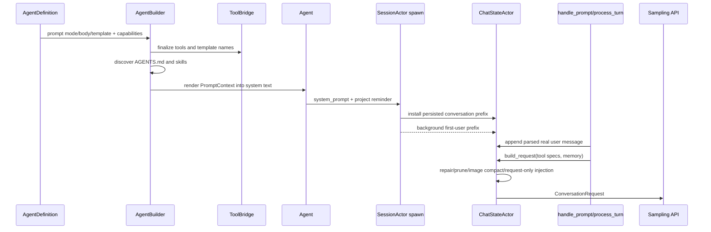

# 源码精读 04：Agent Prompt 如何从模板、项目指令、Skills、用户输入和历史组装成模型请求

> 源码基线：Git `ed6d543`。
>
> 本篇不是列举 Prompt 中“可能有什么”，而是沿生产调用链精读它们到底由哪个函数创建、以哪种 `ConversationItem` Role 插入、在 Conversation 中排在哪里、何时持久化，以及发送前还会发生哪些修复与裁剪。

---

## 1. 先纠正一个常见误解

代码里不存在一个万能的 `build_prompt()`，把所有字符串一次拼完。

最终模型输入来自多层组合：

1. Agent 构建期渲染 System Prompt；
2. Session Spawn 时安装 System 和 Project Instructions；
3. Session 初始化期构建环境前缀与 Skill Reminder；
4. 每轮解析真正的用户输入；
5. Chat State 保存完整 Conversation；
6. 每次模型调用前组装 `ConversationRequest`。

## 2. 本篇核心文件

| 文件 | 责任 |
| --- | --- |
| `xai-grok-agent/src/prompt/template.rs` | System Prompt 模板来源与解密 |
| `xai-grok-agent/src/prompt/context.rs` | System Prompt 的结构化输入与渲染 |
| `xai-grok-agent/src/builder.rs` | 收集工具、规则、Skills 并构建 Agent |
| `xai-grok-shell/src/session/acp_session_impl/spawn.rs` | 把 Agent Prompt 安装进 Conversation |
| `.../prompt_build.rs` | 第一条环境前缀、超长 Prompt 处理 |
| `.../turn.rs` | 每轮用户 Prompt 解析、Skill、图片、Reminder |
| `xai-chat-state/src/actor/request_builder.rs` | 发送前 ConversationRequest 组装 |
| `xai-grok-sampling-types/src/conversation.rs` | Message/Request 权威数据类型 |

## 3. 最终请求的形状

```text
ConversationRequest {
    items: Vec<ConversationItem>,
    tools: Vec<ToolSpec>,
    hosted_tools,
    model,
    temperature,
    max_output_tokens,
    reasoning_effort,
    json_schema,
    request/session/turn ids,
    ...
}
```

Prompt 不只是一段 Text；它是有序 Message Items 加独立 Tool Schema 和采样参数。

## 4. 一张端到端时序图



## 5. 先写下八个不变量

1. System Prompt 必须使用最终可见的 Tool Name 渲染；
2. Conversation 中 System 应位于开头；
3. Project Instructions 应注入一次，Resume/Fork 不重复；
4. Runtime Reminder 必须带 Synthetic Reason，而不是伪装真人输入；
5. 真实 User Query 与环境前缀的顺序必须稳定；
6. 超长 Prompt 截断不能破坏 UTF-8，也不能丢掉尾部问题；
7. Tool Call/Result 历史发送前必须结构完整；
8. `build_request` 的临时裁剪默认不应意外改写权威 Conversation。

## 6. Glossary checkpoint：Prompt 层级

| 名词 | 白话解释 | 本代码中的含义 |
| --- | --- | --- |
| System Prompt | 定义 Agent 身份与长期行为 | 第一条 `ConversationItem::System` |
| User Message | 以用户角色送给模型的内容 | 真人问题或合成提醒 |
| Conversation | 按时间排列的消息和工具结果 | `Vec<ConversationItem>` |
| Request | 一次发给模型 API 的完整对象 | `ConversationRequest` |
| Prompt prefix | 多轮中保持稳定的开头部分 | System、项目指令、环境前缀 |
| Synthetic message | Runtime 生成而非真人输入的消息 | 带 `SyntheticReason` 的 User Item |

## 7. `ConversationItem` 有哪些主要 Variant

源码定义：

- `System`；
- `User`；
- `Assistant`；
- `ToolResult`；
- `BackendToolCall`；
- `Reasoning`。

Client Tool Call 通常嵌在 Assistant Item 中；Server-side Tool Call 使用独立 Variant 保持 Responses API 顺序。

## 8. 为什么 Message Role 很重要

同样一段文字放在 System 与 User Role，模型的优先级和缓存前缀都不同。

代码还需要依靠 Variant 做 Compaction、Pruning、Replay、Tool Call Repair，不能把 Conversation 降级为字符串数组。

## 9. `SyntheticReason` 解决什么

Runtime 会生成 Project Instructions、System Reminder、Working Directory Switch、Task Completed 等 User Item。

结构化 Reason 让下游不必解析文本猜来源，并支持去重、过滤、持久化与统计。

## 10. 为什么项目指令是 User Item

基线实现用：

```rust
ConversationItem::project_instructions(...)
```

它是 `User` Variant，带 `SyntheticReason::ProjectInstructions`。所以“AGENTS.md 属于系统级规则”描述的是语义，不等于它在 Wire Role 上一定是 System。

## 11. System 模板来自哪里

`prompt/template.rs` 提供三份模板：

- Standard Base；
- Apply-patch/Codex Profile；
- Subagent Base。

源码文件位于 `xai-grok-agent/templates/`，编译时转为加扰字节。

## 12. 为什么模板看起来被加密

脚本执行 XOR Obfuscation，避免模板明文直接出现在 Binary `strings` 输出。

注释明确声明这不是 Security Boundary，因为 Seed 也在仓库中。

## 13. `decrypt()` 做什么

它按 Byte Index 将加扰数据与 `seed.wrapping_add(i as u8)` XOR，随后验证 UTF-8。

若生成非法 UTF-8，Panic 信息提示重新运行 `scripts/encrypt_templates.py`。

## 14. 为什么返回 `Zeroizing<String>`

模板明文在对象 Drop 时被清零，减少它长时间残留在进程内存中的机会。

这不改变“Obfuscation 不是加密”的事实，只是更谨慎的内存生命周期处理。

## 15. 模板陈旧测试固定什么

`test_encrypted_templates_not_stale` 对源模板重新 XOR，逐字节比较生成文件。

开发者修改 `.md` 却忘记更新 `prompt_encrypted.rs` 时，测试会直接失败。

## 16. Compact System Prompt 为什么单独是常量

Conversation Compaction 后不一定继续携带完整原 System Prompt。

`COMPACT_SYSTEM_PROMPT` 提供一份短小静态身份说明，降低已压缩上下文的固定 Token 开销。

## 17. Glossary checkpoint：模板

| 名词 | 解释 | 实例 |
| --- | --- | --- |
| Template | 含变量和条件的文本骨架 | `prompt.md` |
| Obfuscation | 增加直接查看难度，不提供机密性 | XOR Template Bytes |
| Security boundary | 真正阻止越权读取的边界 | 本 XOR 不是 |
| Zeroization | 对象释放时清零敏感内存 | `Zeroizing<String>` |
| Stale generated file | 源文件更新但生成物未同步 | Encrypted Template Test |

## 18. `TemplateRenderer` 解决什么

模板里不能硬编码工具名，因为不同 Harness/Client 可能把 Read Tool 命名为 `read_file`、`Read` 或其他名字。

Renderer 提供 `${{ tools.by_kind.read }}` 等语义占位符。

## 19. Tool Name 为什么必须先 Finalize

AgentBuilder 先完成 Tool Registry/Bridge，再渲染 Prompt。

否则 Prompt 可能教模型调用不存在的工具名，或包含已被 Capability Filter 删除的章节。

## 20. 条件模板如何跟 Capability 对齐

模板支持类似：

```text
$ ... $
```

没有 Plan Tool 时，对应行为说明整段省略，而不是留下无效指令。

## 21. 普通双花括号为何不一定是变量

测试确认 `{{ literal_braces }}` 可按普通文本保留。

生产模板使用带 `$` 的 MiniJinja Delimiter，降低代码示例与模板语法冲突。

## 22. `PromptContext` 为什么值得独立成结构体

它把 System Prompt 输入从不可观察的局部变量变成可序列化数据：

- 可以 Dump/Inspect；
- 可以持久化；
- 可以重新渲染；
- 可以在 Model/Harness 切换时复用。

## 23. `PromptContext.version`

Version 为未来持久化 Schema 演进留出空间。

它不是模型版本，也不是 Prompt 文本 Hash。

## 24. `PromptMode` 的两种核心语义

- `Extend`：先渲染 Base Template，再追加 `prompt_body`；
- `Full`：`prompt_body` 就是完整 System Prompt，不自动加 Base。

## 25. `TemplateOverride` 的三种选择

- `None`：Primary 用 Standard，Subagent 用 Subagent Template；
- `Codex`：使用 Apply-patch Profile；
- `Custom(String)`：以调用方模板替代 Base。

这里的 Override 只作用于 Extend Mode 的 Base 选择。

## 26. Full Mode 如何处理 TemplateOverride

`render_with_renderer` 的 Full 分支直接渲染 `prompt_body.unwrap_or("")`。

不会再读取 Standard/Codex/Custom Base，所以配置时不能假设二者叠加。

## 27. `PromptAudience` 的作用

- `Primary`：顶层交互 Agent；
- `Subagent`：子 Agent，使用更紧凑 Base，抑制 Parent-only Catalog。

Audience 不等同于 Model，也不等同于 Permission Mode。

## 28. `prompt_body` 是什么

Agent Definition 自带的角色化附加指令。

Extend Mode 中它追加到 Base 后，且同样通过 Template Renderer，所以能引用真实 Tool Name。

## 29. Role 与 Persona Instructions 在哪里

它们被放入 `PromptContext` Placeholder：

- `role_instructions`；
- `persona_instructions`。

模板决定是否以及在哪里展开，作为 Durable Identity，而不是每轮临时 User Task 文本。

## 30. User Info 也有 System 侧占位符

Context 保存 OS、Shell Path、Working Directory、Current Date、Non-interactive Flag 和 Identity Label。

不要因此推断所有环境信息只出现一次；第一条 User Prefix 还有独立、通常更详细的环境块。

## 31. Memory Placeholder

`memory_enabled` 及 Global/Workspace Memory Path 进入模板。

这告诉模型 Memory Capability 存在；真正 Memory Reminder 还可能在每轮 Request Build 时注入。

## 32. 为什么 Placeholder 缺失时用空字符串

`placeholders()` 对 Optional String 使用 `unwrap_or("")`。

模板通过条件判断是否展示，避免把 JSON `null` 意外渲染成用户可见文本。

## 33. `system_prompt_label` 与 Agent Picker Name 不同

它控制 Base Prompt 中类似“You are Grok”的身份 Label。

Agent Definition Name 主要用于选择和遥测，两者不能混为一个字段。

## 34. Glossary checkpoint：PromptContext

| 名词 | 解释 | 实例 |
| --- | --- | --- |
| Prompt Mode | Base 与自定义正文的组合方式 | Extend/Full |
| Audience | Prompt 面向父 Agent 还是子 Agent | Primary/Subagent |
| Placeholder | 渲染时替换的结构化值 | Current Date、Tool Name |
| Durable identity | 跨 Turn 持续存在的角色规则 | Role/Persona Instructions |
| Prompt body | Agent Definition 追加或替代的正文 | `prompt_body` |
| Override | 改变默认模板来源 | Standard/Codex/Custom |

## 35. `render_with_renderer()` 的 Extend 精确顺序

1. 选择 Base Template；
2. 用 Tool + Agent Placeholders 渲染 Base；
3. 若有 Body，追加两个换行；
4. 尝试渲染 Body；
5. Body 渲染失败时退回原 Body。

## 36. Base 渲染失败为何返回 None

Base 是 Agent 行为骨架，变量解析失败意味着无法安全生成完整 Prompt。

实现使用 `?` 直接传播 None；AgentBuilder 最终 `unwrap_or_default`，因此失败会形成空 System Text，而测试和日志应尽早发现模板问题。

## 37. Body 渲染失败为何可降级

自定义正文可能包含不兼容模板符号。

保留原文比完全丢失用户的 Agent Instructions 更有价值，所以使用 `unwrap_or_else(|| body.clone())`。

## 38. `render()` 为什么先取 Renderer Snapshot

`ToolBridge` 内部 Tool Name/Param Name 受 Finalized Registry 决定。

Snapshot 给本次渲染一个一致视图，避免一段 Prompt 中不同占位符来自不同 Registry 状态。

## 39. `PromptContext` 为什么仍保存 `agents_md_files`

System Renderer 本身并不把它们直接拼到 Base 字符串。

Context 同时服务后续 `agents_md_user_reminder()`，并作为可检查、可持久化的发现结果容器。

## 40. `format_agents_md_section()` 的产物

它委托 `agents_md::format_agents_md_section`，返回包裹为项目规则区块的文本。

为空时返回 None，避免注入空 Reminder。

## 41. Personas 当前为什么不注入 Catalog

`format_personas_section()` 基线实现固定返回 None，注释说明 Task Tool 的 Persona 参数已删除。

字段仍保留是兼容/结构演进痕迹，不能仅看字段就断言功能仍生效。

## 42. Subagent 的 Project Instructions 是否缩短

`agents_md_user_reminder()` 对 Primary 和 Subagent 都返回完整 Block。

子 Agent 仍需看到相同项目规则；被压缩的是 Base/Catalog，而不是项目约束正文。

## 43. AgentBuilder 在 Prompt 之前先做什么

它先解析 Agent Definition，决定工具、能力、Skills、兼容 Surface，Finalize `ToolBridge`，再读取 AGENTS.md，最后创建 `PromptContext`。

Prompt 是构建结果，不是构建输入的唯一来源。

## 44. Skills 在 Builder 的两个角色

- Definition 指定的预加载 Skill，可形成直接注入或资源；
- 自动发现 Skill 列表被 Seed 到 Bridge 的 Discovery Tracker，供 Catalog/Reminder。

完整机制下一篇精读；本篇只跟踪它们何时影响 Conversation Prefix。

## 45. AGENTS.md 在 Builder 中何时读取

若 `definition.agents_md` 为 True，调用：

```text
read_agents_config_with_paths(working_dir, compat)
```

否则 Context 中保存空列表。

## 46. 为什么还把路径 Seed 给 ToolBridge

Bridge 需要追踪后续 Tool Read/Write 是否发现新的 AGENTS.md，并处理 Gitignore/动态提醒。

启动时发现结果既用于初始 Prompt，也用于 Runtime Discovery State。

## 47. Display CWD 为什么替换路径文本

工具实际 Working Directory 与模型看到的 Display Path 可能不同，例如 Remote/Worktree 映射。

Builder 会把 AGENTS.md File Path 和 Working Directory Placeholder 改写成 Model-facing Path。

## 48. `PromptContext` 的时间字段来自何时

Builder Capture `Utc::now()`，System Current Date 使用 Local Time 格式 `%Y-%m-%d`。

它代表构建时快照，不会每个 Turn 自动重渲染；日期跨天另有 Reminder 路径。

## 49. Agent 为什么缓存渲染结果

`Agent` 同时保存：

- `prompt_context`；
- `system_prompt: String`。

常规读取无需每次重新锁 Bridge 和运行模板；需要 Tool Override/Harness Change 时可 `finalize_prompt()`。

## 50. `finalize_prompt()` 做什么

更新 Build Timestamp，再从当前 Bridge State 重新渲染 System Prompt。

它不会自动修改已经存在于 Chat History 的 System Item；Host 还必须通过相应 Session 操作替换头部。

## 51. Glossary checkpoint：Agent 构建

| 名词 | 解释 | 实例 |
| --- | --- | --- |
| Agent Definition | 声明 Agent 类型、Prompt 和能力的配置 | `AgentDefinition` |
| Agent Builder | 把定义和 Session 资源变成 Agent | `AgentBuilder` |
| Tool Bridge | 工具注册、资源和模板名的桥梁 | `ToolBridge` |
| Finalization | 冻结/解析工具定义供 Prompt 和 API 使用 | Registry Finalize |
| Display path | 模型看到的路径 | Remote/Worktree 映射后 CWD |
| Cached render | 保存已渲染文本避免重复工作 | `Agent.system_prompt` |

## 52. Spawn 时从 Agent 取出什么

`spawn_session_actor` 获取：

```text
system_prompt = agent.system_prompt().to_string()
prompt_context = agent.prompt_context().clone()
```

Context 先 `normalize_for_persistence()`，再写入 Session 文件供 Inspect/Restore。

## 53. 为什么 PromptContext 要持久化

仅保存最终字符串无法解释它由哪些规则、模板和 Placeholder 产生。

结构化 Context 可用于 Debug、CLI Inspect、兼容迁移与重新渲染。

## 54. `install_system_prompt()` 的四种行为

| Conversation 状态 | Spawn 类型 | 行为 |
| --- | --- | --- |
| 头部已有 System | Top-level Resume | 保留 Stored System |
| 头部已有 System | Subagent，非 Preserve | 覆盖为 Fresh Child System |
| 头部已有 System | Preserve Inherited | 保持 Parent System |
| 头部没有 System | 任意 | 在 Index 0 插入 |

## 55. 为什么 Top-level Resume 保留旧 System

历史 Conversation 与原 System Prompt 共同形成稳定 Prefix。

Resume 时使用当前配置重新渲染并覆盖，会改变旧 Session 的语义，也会破坏 Provider KV-cache Prefix Stability。

## 56. 为什么 Subagent 通常覆盖 System

Child 有自己的 Audience、Role 和 Toolset。

继承 Parent Transcript 时，头部 Placeholder 必须变成 Child Prompt，否则 Child 会继续执行 Parent 身份。

## 57. `preserve_inherited_system` 的特殊意义

某些 Verbatim Fork 要完全继承 Parent Prefix。

此 Flag 明确压过“Subagent 总是重渲染”的默认规则。

## 58. `inherited_prefix_len` 为什么同步增加

Subagent/Fork 可能记录一段不可被后续 Compaction 或 Context Mutation破坏的继承前缀长度。

若函数新插入 System，Prefix 边界必须加一。

## 59. Project Instructions 插在哪里

条件满足时：

```rust
let insert_at = conversation.len().min(1);
conversation.insert(insert_at, project_instructions)
```

正常结果是 Index 0 System、Index 1 Project Instructions。

## 60. Project Instructions 的注入条件

同时要求：

- 不 Preserve Inherited System；
- Conversation 尚未有 Project Instructions；
- Agent Context 实际发现了规则。

## 61. 去重为何同时支持新旧格式

新格式检查 `SyntheticReason::ProjectInstructions`。

旧 Session 可能没有 Tag，于是还检查第一段 Text 是否以 Legacy Reminder Prefix 开头。

## 62. 为什么不能简单查字符串完全相等

规则正文或格式可能变化；Resume 的要求是识别“已有这一类结构”，不是比较当前重新发现内容。

Tag 是比正文 Equality 更稳定的身份。

## 63. Project Instructions 何时持久化

System/Project Reminder 安装后，Spawn 调用：

- `save_system_prompt`；
- `persist_chat_history_jsonl_sync`；
- `chat_state_handle.replace_conversation`。

所以它是 Durable Conversation Prefix，不是 Request-only 临时文本。

## 64. Permission Classifier 为什么也接收规则

Spawn 把 AGENTS.md Section 的正文写入 Permission Manager 的 Project Instructions。

自动权限分类器需要知道项目安全规则，但它有自己的 Classifier Message Pipeline，不直接复用主模型完整 Conversation。

## 65. Glossary checkpoint：Session 安装

| 名词 | 解释 | 实例 |
| --- | --- | --- |
| Spawn | 创建 SessionActor 和初始状态 | `spawn_session_actor` |
| Resume | 从已有历史继续 | 保留 Stored System |
| Fork | 从现有 Conversation 分支 | 可继承 Prefix |
| Idempotent injection | 重复执行也只出现一份 | Project Instructions 去重 |
| Durable prefix | 写入历史并跨 Turn 保存 | System + Project Instructions |
| Prefix length | 被继承/保护的开头 Item 数量 | `inherited_prefix_len` |

## 66. 第一条环境前缀是什么

它是 Session 初始化时构建的一条 User Item，通常包含 Workspace、OS、Shell、Date 和 Git Status。

它不是用户刚输入的任务，也不是 System Prompt。

## 67. 为什么环境前缀异步构建

Git/JJ Status、规则、Skills 和 MCP Handshake 可能涉及 I/O。

Session 先初始化 System/Skill Reminder，再在 Background 构造 Prefix，避免阻塞整个启动路径。

## 68. `ensure_prefix_ready()` 的职责

第一个真实 Turn 前等待 Deferred Prefix。

后台任务超时或 Panic 时，回退到同步构建，确保模型不会在缺少 Workspace Context 的状态下开始。

## 69. Prefix 插入位置为什么是 Index 1

`rewrite_zero_turn_prefix` 把无 Synthetic Reason 的普通 User Prefix 放在 System 后。

但若 Index 1 已是 Project Instructions，实际插入逻辑需要结合当前 Zero-turn Shape；函数用 `min(1)` 与已有 Slot 判定维护约定。

## 70. 这里为什么容易混淆

启动路径有两种来源：

- Spawn 已加载的历史 Conversation；
- Fresh Initialize 先只有 `[system, skill_reminder?]`。

Prefix Rewrite、Project Reminder 和 Skill Reminder 的相对顺序由不同函数维护，不能只看一个函数猜最终数组。

## 71. 默认 UserMessageTemplate 的行为

`UserMessageTemplate::Default` 不经过 `UserMessageContext::render`。

Shell 使用 Legacy `construct_user_message` 或 Minimal 版本创建环境前缀。

## 72. Custom UserMessageTemplate 的行为

Shell 收集结构化 `UserMessageContext`，再通过 `ToolBridge::render_prompt` 渲染调用方模板。

Custom Template 也能引用 `${{ tools.by_kind.read }}` 等最终 Tool Name。

## 73. Custom Prefix 的输入字段

包括：

- Workspace Path；
- Kernel/Release 风格 OS 信息；
- Shell Basename；
- VCS Root/Status；
- Local Date；
- Terminals Folder；
- Workspace/User Rules；
- Skill Registry Snapshot；
- MCP Server Metadata；
- Read Tool Name。

## 74. 为什么 System 与 User Prefix 都有环境信息

它们服务不同模板/Harness 兼容层。

System Context 保存基础身份占位符；第一 User Prefix 是更具体、可替换的 Session Workspace Snapshot。不能假定每种模板两者都完整重复。

## 75. Git Status 的上限

`GIT_STATUS_CHARACTER_LIMIT = 10_000`，按 Repo 在 Render 时限制。

原始 Gather 结果不先截断，其他消费者仍能使用完整 Status。

## 76. Git Status 如何 UTF-8 安全截断

先退到 Character Boundary，再尽量退到最后一个 Newline，追加 Truncated Marker。

Whitespace-only Status 直接返回 None，不输出空 Code Fence。

## 77. VCS Gather 的超时

Prompt Build 对 Git/JJ Status 使用 5 秒 Timeout。

失败或空结果只省略 Status，不阻断 Session Prompt。

## 78. 规则为什么分 User Scope 与 Workspace Scope

`partition_rules_by_scope` 根据 Grok Home、Vendor Home 和 Workspace Root 分类。

Custom Template 可分别呈现全局用户偏好和项目规则，避免把路径位置误当规则优先级。

## 79. Skill Listing 怎样进入 Custom Prefix

`render_skill_listing_xml()` 把 `SkillInfo` 转成 `<agent_skill>` XML Rows。

非特殊兼容模板使用 Budgeted Mode，并在溢出时给出 Indicator；完整 Skill 正文不在这里展开。

## 80. 为什么只列 Skill Metadata

启动时把全部 `SKILL.md` 正文塞进 Prefix 会快速耗尽 Context。

Catalog 让模型先知道 Name/Description/Path，需要时再读取完整 Skill，实现 Progressive Disclosure。

## 81. Skill Listing Budget 从哪里来

Context 可传显式 Character Budget；None 时共享 Renderer 使用标准的 Context-window 比例启发式。

这是 Catalog Budget，不是 Skill 被激活后完整正文的唯一预算。

## 82. MCP Metadata 在 Prefix 中做什么

Custom Template 可告诉模型有哪些 Connected Servers、Server Use Instructions 和 Descriptor Folder。

Tool Schema 本身仍由 Tool/Descriptor/Search 机制提供，不必全部复制进 Prefix。

## 83. Custom Render 失败如何处理

记录 Warning，回退 Legacy Prefix。

若 Custom Template 本应呈现日期但失败路径不呈现相同日期语义，代码用 `prefix_carries_fallback_date` 跟踪，供 Date-rollover Reminder 正确判断。

## 84. Glossary checkpoint：第一用户前缀

| 名词 | 解释 | 实例 |
| --- | --- | --- |
| Environment preamble | 任务前的工作区环境说明 | OS/CWD/Git/Date |
| Legacy path | 为兼容保留的旧构造流程 | `construct_user_message` |
| Custom template | 用户/Agent 自定义第一消息模板 | `UserMessageTemplate::Custom` |
| Catalog | 只列可用项摘要而非全文 | Skill Listing |
| Progressive disclosure | 需要时再加载详细内容 | Catalog → Read SKILL.md |
| Graceful fallback | 渲染失败仍生成可用前缀 | Custom → Legacy |

## 85. Fresh Initialize 时 Skill Reminder 怎样出现

`initialize()` 先建立 `[System]`，再调用 `inject_baseline_skill_reminder`。

若当前 Harness 使用 Reminder 模式且有 Pending Skills，追加一条带 `SyntheticReason::SystemReminder` 的 User Item。

## 86. 为什么 Baseline Reminder 先清旧项

Zero-turn Harness Rebuild 可能从一个 Reminder-using Agent 切到另一个。

函数先 Retain 删除旧 Baseline，再 Drain 当前 Bridge Pending Update，保证恰好一份。

## 87. Inline Skill Listing 与 Reminder 为什么互斥

某些模板把 `<agent_skills>` 直接渲染进第一 User Prefix。

这类 Agent 仍要 Drain Discovery State 以记录 Announced Names，但 `wrap_skill_reminder` 不再生成第二份 Catalog。

## 88. `announced_names` 解决什么

运行中发现新 Skill 时只提醒新增项。

若启动 Catalog 已展示却未标记 Announced，Watcher 下一轮会把全部 Skill 重复注入。

## 89. Project Reminder 与 Skill Reminder 的区别

- Project Instructions：完整项目规则、Durable、去重后持久化；
- Skill Reminder：可用 Skill Catalog、可热更新、带 SystemReminder Tag；
- 激活 Skill 正文：跟随具体 User Turn 注入，机制在下一篇展开。

## 90. 第一条真人 Prompt 从哪里进入

`SessionActor` 的 Prompt Handler 接收 ACP `ContentBlock` 数组。

它先 Echo/Persist 原始 Blocks，再调用 `parse_prompt_with_skills` 形成结构化 Parsed Prompt。

## 91. 为什么先保留原始 ContentBlock

原输入可能包含 Text、Image、Resource 等结构。

UI Echo、Session Replay 与模型归一化需求不同，不能只保存最终合并字符串。

## 92. Slash Skill 何时解析

在正式 Parse 前，代码识别引用的 Slash Skills，记录 Active Skill/Telemetry，并构建 `pending_skill_information`。

随后把它交给 `parse_prompt_with_skills`。

## 93. `ParsedPrompt` 的五部分

```text
context
query
skill_information
images
is_cursor
```

把上下文、真实问题和 Skill Instructions 分开，才能按 Harness 顺序组装并独立预算。

## 94. 为什么 Context 与 Query 不立即拼接

不同 Harness 要求不同顺序；超长 Prompt 分配预算时也要优先保留 Query 与 Skill Information。

过早拼成一个 String 会失去这些结构信息。

## 95. `assemble_parts_with_skills()` 的角色

它根据 `is_cursor` 等兼容语义把三段变成 Model-facing User Text。

该结果在未截断时就是写入 Conversation 的正文。

## 96. 图片占位符为什么需要恢复

Client 可能在 Text 中留下路径 Placeholder，却没有把对应 Binary Image Block 正确带上。

Server-side Fallback 从 Workspace 恢复孤立图片，再从文本里移除路径泄漏。

## 97. Base64 Image 为什么从 Query 抽取

非兼容 Harness 下，内嵌 Data URL 会让 Text 巨大且失去结构化多模态语义。

代码把它们变成 Image Content，留下 Cleaned Text。

## 98. 图片怎样进入 ConversationItem

先创建 User Item，再为每张图片添加 URL/Data URL Content Part。

因此模型请求中 User Message 可以同时包含 Text 与 Image，而不是用 Markdown 字符串模拟图片。

## 99. Prompt Origin 为什么改变 Synthetic Reason

同一入口也处理 Task Completed、Subagent Completed、Workflow Completed、Goal Summary 等自动消息。

不同 Origin 使用不同 `ConversationItem` Constructor，后续逻辑能区分真人 Turn 和自动唤醒。

## 100. User Item 何时带 Prompt Index

在 Push 前调用 `set_prompt_index(current_prompt_index)`。

这将 Message 与 Turn、Rewind、Telemetry 和文件快照关联起来。

## 101. 为什么 Push User 是 Actor Mutation

`ChatStateActor` 串行拥有 Conversation。

所有 Turn、Tool Result、Compaction 修改通过 Command Channel，避免多个异步任务直接同时改 Vec。

## 102. Persist Ack 路径有什么不同

需要严格持久化确认时使用 `push_user_message_and_ack`，再要求 Persistence Queue `FlushAndAck`。

只有消息进入 Chat State 且磁盘刷新成功才返回 Ack，适合客户端要求 Durable Submit 的场景。

## 103. Glossary checkpoint：真实用户输入

| 名词 | 解释 | 实例 |
| --- | --- | --- |
| Content Block | ACP 输入中的结构化片段 | Text/Image/Resource |
| Parsed Prompt | 被拆分后的上下文、问题、Skill、图片 | `ParsedPrompt` |
| Prompt Origin | 这条 User-role Item 由谁触发 | User/TaskCompleted 等 |
| Multimodal message | 同一消息包含文字和图片 | User Content Parts |
| Durable submit | 返回前确认消息已持久化 | Push + Flush Ack |
| Actor ownership | 由单任务串行修改状态 | `ChatStateActor` |

## 104. 为什么需要超长 Prompt Offload

用户可能粘贴几十万字符，直接放进当前 Turn 会超过 Context Window。

基线阈值 `LARGE_PROMPT_THRESHOLD = 25_000` Bytes，超过后保存全文到 Session File，并只发送有界摘要与路径提示。

## 105. Threshold 为什么按 Byte 而非 Token

Byte Length 计算稳定、便宜，不需要在输入热路径调用 Tokenizer。

它是保护性上限，不是精确 Context Token 预算。

## 106. Head+Tail 为什么优于只保留 Head

长粘贴常把真正问题写在最后。

`bound_head_tail` 保留开头和最多 4000 Bytes 尾部，中间插入明确 Elision Marker。

## 107. UTF-8 如何保证不被切坏

Prefix/Suffix Helper 都移动到合法 Character Boundary。

不会把多字节中文或 Emoji 切成非法 String。

## 108. Query Budget 的优先级

可用预算中：

- Skill Instructions 有独立最多 4000 Bytes；
- 剩余约 80% 给 Query；
- Context 使用余量头部。

这明确表达“用户问题和激活 Skill 比附加 Context 更重要”。

## 109. 为什么 Skill 有独立预算

若 Query 很长先吃完全部预算，模型可能只知道用户要使用某 Skill，却看不到 Skill 的执行规则。

独立 Budget 防止 Skill Instructions 被 Query 挤出。

## 110. Full Request 保存在哪里

函数构建 Session-local File Path，写入完整 Assembled Message。

发给模型的 Notice 明确要求先用 Read Tool 读取该文件，因为真实问题可能只在被截断中间。

## 111. 写文件失败为什么不能继续给路径

不存在的路径会让 Agent 反复 Read 失败。

`write_offload_and_build` 用无路径的 Failure Notice 替换原 Notice，并要求基于现有 Excerpt 回答或请用户重发。

## 112. 为什么写失败也不回退完整原文

完整原文正是触发 Context Overflow 的原因。

失败路径仍必须维持 25K 有界消息，不能为了“保数据”重新引入已知溢出。

## 113. `verbatim` 为什么绕过截断

某些内部/Fork 场景要求字节级保留输入，调用方显式承担上下文风险。

普通用户 Prompt 使用安全 Offload 路径。

## 114. Cursor 与 Grok 顺序为什么不同

`build_truncated_prompt_message` 根据 `is_cursor` 选择 Context/Query/Notice 的排列。

这是 Harness Compatibility Contract，不能在通用 Helper 中强行统一顺序。

## 115. Glossary checkpoint：超长输入

| 名词 | 解释 | 实例 |
| --- | --- | --- |
| Offload | 把大正文移到文件，只在消息里留指针 | Large Prompt File |
| In-band excerpt | 仍直接放在消息里的有界文本 | Head + Tail |
| Elision marker | 明确表示中间被省略 | `…middle truncated…` |
| Byte budget | 按 UTF-8 字节计的上限 | 25,000 Bytes |
| Verbatim | 不改写、不截断 | 特殊内部路径 |
| Failure-safe notice | 不引用不存在文件的降级提示 | Offload Failed Marker |

## 116. Turn 开始前还会注入哪些 Reminder

在 Push 真人 User Item 前后，Session 可能注入：

- MCP Ready/Connecting；
- Date Rollover；
- Plan Mode；
- Resumed Tasks；
- Deferred Completion；
- Workflow Status；
- Interrupt Context。

它们多数是带 Synthetic Reason 的 User Items。

## 117. 为什么 Reminder 不全放 System Prompt

许多状态是运行中变化的：MCP 刚连接、日期跨天、权限模式切换、后台任务完成。

重写 System 会破坏长 Prefix；追加短 Synthetic User Reminder 更适合动态状态。

## 118. 每个 Tool Loop 前还会 Drain 什么

`process_conversation_turn` 的循环每次采样前处理：

- Pending Interjections；
- Pending Skill Reminders；
- Monitor Events；
- First-turn Memory Reminder；
- MCP Reminder；
- Auto Compaction。

因此一次 User Turn 内第二次模型调用看到的 Context 可能比第一次多 Tool Result 和新 Reminder。

## 119. “一个 Turn”为什么可能发多个模型请求

模型第一次返回 Tool Call；Runtime 执行工具并把 Tool Result 追加 Conversation；随后再次采样。

直到模型返回 Final Answer 或命中终止条件。

## 120. Tool Definitions 何时准备

`process_conversation_turn` 开头调用 `prepare_tool_definitions_timed()`。

Blocking MCP Strategy 可能等待初始化；Progressive Strategy 不阻塞。得到的 Built-in Definitions 再按 Plan Mode 等过滤。

## 121. 为什么 Tools 不拼进 Message Text

工具通过 `ConversationRequest.tools: Vec<ToolSpec>` 独立发送，包含 Name、Description 与 JSON Parameters Schema。

System Prompt 只解释使用策略和真实 Tool Name，Schema 由 API 专门字段承载。

## 122. Hosted Tools 又是什么

Web/X Search 等可能由模型后端直接执行，放在 `hosted_tools`，而不是普通 Client Function Tool List。

每轮还会应用 Tool Overrides 和 Model Capability Gate。

## 123. Structured Output 如何影响 Request

支持 Native Schema 的 Backend 设置 `request.json_schema`。

不支持时临时追加一个 `StructuredOutput` Tool，并注入 System Reminder 要求最终调用它。

## 124. `ChatStateHandle::build_request()` 是什么边界

SessionActor 不直接 Clone/Prune Conversation，而向 ChatStateActor 发送 `BuildConversationRequest` Command。

Actor 在串行上下文内先保证 History Integrity，再构造请求。

## 125. 为什么发送前再次 Repair

正常写边界已经 Repair Tool Call/Result。

Build Command 仍保留 Guard，因为它只在 Agent Loop 的 Turn 间发出，能防持久化恢复或异常路径留下 Dangling Tool Call。

## 126. `build_conversation_request` 的五步

源码注释列出：

1. 接近 50MB 时驱逐旧 Inline Images；
2. Context 使用超过 50% 时裁剪旧 Tool Results；
3. 可选把 Memory Reminder 持久写入 Actor State；
4. 否则只注入 Request Clone；
5. 填充 `ConversationRequest`。

## 127. Hot Path 为什么只 Clone 一次

如果无需 Prune、Memory 或 Image Compaction，直接 Clone 权威 Conversation 到 Request。

不创建第二个可变工作副本，也不运行无意义 O(n) Pass。

## 128. Tool Result Pruning 何时触发

`total_tokens > context_window / 2` 时，按配置裁剪较老、较大的 Tool Result。

它保留 Conversation 结构，只减少不再值得占用 Context 的结果正文。

## 129. Request-only Pruning 与权威历史的区别

通常 Prune 操作在 Clone 上执行，磁盘和 Actor Conversation 保留更完整记录。

模型看到的是预算化 Context，Session Replay 仍可拥有原始 Tool Result。

## 130. 图片为什么到 50MB 附近才 Compact

每轮都驱逐旧图片会改写 Prefix，导致 Provider KV Cache 持续 Miss。

只有 Wire Body 接近上限才批量回收到 Low-water Mark，用一次 Prefix 变化换取多轮稳定。

## 131. Memory Reminder 的两种注入模式

- `persist_memory_reminder = true`：写入 Actor Conversation 并 Persistence；
- False：只注入本次 Request Clone。

这允许 Durable Memory Context 与临时提示共享同一 Helper。

## 132. Memory 为什么注入 System Item

`inject_memory_reminder` 把 Memory 语义合并到 System 区域，使其作为长期 Context，而不是看起来像用户刚说的话。

若 Conversation 没有 System，测试覆盖相应插入行为。

## 133. Turn Capture 为什么要 Rebase

持久 Memory 注入可能在 Conversation 头部插入 Item，导致正在记录的 Turn Slice Index 全部后移。

源码先 Snapshot，再注入，最后 Rebase Offset，避免 Trace 捕获错段。

## 134. Request 的 Sampling 字段从哪里来

Chat State 保存 `SamplingConfig`，Build 时填入：

- Model；
- Temperature；
- Max Completion Tokens；
- Top P；
- Reasoning Effort。

SessionActor 随后补充 Hosted Tools、Schema、IDs 与 Per-turn Overrides。

## 135. 为什么 Request ID 不属于 Conversation

Conversation 是可重放语义历史；Request/Session/Turn ID 是一次传输与遥测属性。

它们放在 Request 顶层，不污染消息正文和 Prefix Cache。

## 136. Glossary checkpoint：请求组装

| 名词 | 解释 | 实例 |
| --- | --- | --- |
| Tool Spec | 模型可调用函数的结构化 Schema | Name/Description/Parameters |
| Hosted tool | 由模型服务端执行的工具 | Web/X Search |
| History repair | 修复 Tool Call 与 Result 配对 | Integrity Guard |
| Request clone | 发送前从权威历史复制的版本 | Pruning 工作副本 |
| KV cache prefix | Provider 对稳定输入开头的计算缓存 | 避免每轮改写旧 Item |
| Sampling config | 控制模型生成的参数 | Model/Temperature/Effort |

## 137. Message 顺序的典型 Fresh Session 形状

不同 Template/Skill 模式略有差异，但可用下列模型理解：

```text
[0] System: rendered agent identity and durable behavior
[1] User synthetic: project instructions or environment prefix
[2] User synthetic/plain: remaining startup prefix/reminder
[3] User: first real query
[4] Assistant: response/tool calls
[5] ToolResult
[6] Assistant: final answer
...
```

不要把索引 1/2 的绝对顺序当跨 Harness 永恒 ABI，应依靠 Synthetic Reason 识别语义。

## 138. 为什么 Prefix Stability 被大量测试

Responses API 的 Server-side KV Cache 对输入前缀字节和 Item 顺序敏感。

插入重复 Reminder、无谓重写图片或改变 Reasoning Sibling 顺序，功能可能仍正确但成本和延迟显著上升。

## 139. Reasoning 为什么保留为 Sibling Item

Backend Tool Call 前后可能有多段 Reasoning。

独立保存能保持服务端返回的交错顺序，避免下一 Turn 重发时发生 Last-write-wins 或 Prefix Byte Drift。

## 140. Compaction 如何改变 Prompt

Auto Compaction 会把旧历史替换成 Summary/Compact Context，并可能使用 Compact System Prompt。

但 Project Instructions、必要 Prefix 与最新用户语义仍需按 Compaction Contract 保留或重新注入，不能简单截断 Vec 前半段。

## 141. 为什么本篇不把 Compaction 展开

Compaction 是独立的模型调用、历史 Filter 和替换事务，已有 Walkthrough 05。

本篇只标明它发生在每次采样前，可能改变 `build_request` 读取的 Conversation。

## 142. Prompt Inspection 应看什么

调试时至少分别检查：

1. Persisted `PromptContext`；
2. Persisted System Prompt；
3. `chat_history.jsonl` 的 Conversation Items；
4. 最终 Request 的 Tools/Hosted Tools/Sampling Metadata。

只打印一个字符串看不到完整模型输入。

## 143. 常见错误一：把 AGENTS.md 直接追加到 System String

基线架构把它作为 Tagged Project Instructions User Item。

绕过 Constructor 会失去去重 Tag、Compaction 识别和 Resume 兼容逻辑。

## 144. 常见错误二：工具注册后不重新渲染 Prompt

Tool Name 或 Capability 变化，旧 Prompt 仍会指导模型调用已删除/改名工具。

需要重新 Finalize Prompt，并由 Host 更新 Conversation System Head。

## 145. 常见错误三：Runtime 状态都写进 System

每次 MCP/Date/Task 变化都重写开头会破坏 Prefix Cache，也让历史身份不稳定。

动态信息应使用结构化 Reminder 追加。

## 146. 常见错误四：Synthetic User Item 不打 Tag

Resume 时无法可靠去重；Analytics 会把它当真人输入；Pruning/Compaction 只能脆弱地 Parse Text。

## 147. 常见错误五：超长输入只保留开头

用户的最终问题常在末尾。

应保留 Head+Tail，并把完整文本 Offload 到可读取文件。

## 148. 常见错误六：发送前直接修改权威历史

Request Budget Pruning 若写回 Actor，会永久损失 Session Replay 数据。

除明确选择 Persist 的 Memory 等路径外，应在 Clone 上变换。

## 149. 常见错误七：只测试渲染文本包含某单词

更重要的合同包括：

- Item Role；
- Item 顺序；
- Synthetic Reason；
- Resume 去重；
- Tool Name 与 Tool Specs 一致；
- 第二轮 Prefix Byte Stability。

## 150. Glossary checkpoint：工程风险

| 名词 | 解释 | 实例 |
| --- | --- | --- |
| Role confusion | 把 System/Project/User 混为一类文字 | AGENTS.md Role |
| Duplicate injection | Resume 后同一规则出现两份 | Project/Skill Reminder |
| Prefix drift | 旧输入开头无必要地改变 | KV Cache Miss |
| Authority | 哪份数据应被永久保留 | Actor Conversation |
| Request-time transform | 只为本次发送临时修改 | Tool Result Pruning |
| Structural test | 检查 Role/顺序/Tag，而非仅文本 | Prefix Stability Tests |

## 151. Template Tests 固定什么

`template.rs` 的测试覆盖：

- 加扰生成物未陈旧；
- Tool/Agent Variable 替换；
- Capability 条件段；
- Tool Name Override；
- Base/Codex/Subagent 模板均能完整解析；
- 不留下 `${{` 或 `${%` 未解析标记。

## 152. PromptContext Tests 固定什么

73 项测试覆盖序列化兼容、Placeholder 完整性、Audience 差异、Extend/Full、Role/Persona、Memory、AGENTS.md Reminder 和不同 Tool Capability 下的渲染。

这里是判断“字段存在但是否真的生效”的首要证据。

## 153. UserMessageContext Tests 固定什么

测试聚焦 Template Deserialize、Date Placeholder 和 Git Status：

- 短文本原样；
- 空白被省略；
- 超限 UTF-8 安全截断并有 Marker。

## 154. Prompt Build Tests 固定什么

基线文件内测试覆盖 Rule Scope Partition、System Install、超长 Prompt Head/Tail、Offload Notice 与失败降级。

它们把最容易在 Resume 和大输入场景中丢数据的边界固化下来。

## 155. Chat State Build Request Tests 固定什么

测试包括：

- 所有消息进入 Request；
- System 保留；
- Empty Conversation；
- Memory 注入与可选持久化；
- Tool Definition；
- Sampling Config；
- Dangling Tool Repair；
- Request Build 不意外修改 Actor State；
- 多轮 Prefix Stability；
- Old Image Budget。

## 156. 推荐跟读路线一：System Prompt

```text
AgentRebuildSpec::build_agent_inner
  -> AgentBuilder::build
  -> ToolBridge::finalize_builder
  -> PromptContext { ... }
  -> PromptContext::render
  -> render_with_renderer
  -> Agent::new
```

## 157. 推荐跟读路线二：Session Prefix

```text
spawn_session_actor
  -> install_system_prompt
  -> conversation_has_project_instructions
  -> ConversationItem::project_instructions
  -> persist_chat_history_jsonl_sync
  -> ChatStateHandle::replace_conversation
```

## 158. 推荐跟读路线三：第一用户前缀

```text
SessionActor::initialize
  -> inject_baseline_skill_reminder
  -> build_prefix_background
  -> build_user_message_prefix
  -> build_templated_user_message / legacy path
  -> ensure_prefix_ready
```

## 159. 推荐跟读路线四：真人 Prompt

```text
handle_prompt
  -> slash skill resolution
  -> parse_prompt_with_skills
  -> normalize images
  -> assemble_parts_with_skills
  -> maybe_truncate_large_prompt_with_skills
  -> ConversationItem::user
  -> ChatStateHandle::push_user_message
```

## 160. 推荐跟读路线五：最终请求

```text
process_conversation_turn
  -> prepare_tool_definitions_timed
  -> ChatStateHandle::build_request
  -> ensure_conversation_integrity
  -> build_conversation_request
  -> add hosted tools / ids / schema
  -> sampling client
```

## 161. 手工实验一：打印 Message Types

在测试 Session 构建后，只打印每个 Item 的：

```text
index, variant, synthetic_reason, text length
```

不要先打印完整敏感正文。观察 Fresh、Resume、Subagent 三种 Prefix 差异。

## 162. 手工实验二：禁用一种 Tool

从 Agent Definition 删除 Read 或 Plan Capability，重新渲染 System Prompt。

验证对应模板章节消失，且 Request `tools` 中同样不存在该 Tool。

## 163. 手工实验三：重复 Resume

用同一 Chat History 连续 Resume 两次，统计 `SyntheticReason::ProjectInstructions`。

结果应始终为 1，而不是每次启动增加一份。

## 164. 手工实验四：超长中文 Prompt

构造超过 25K Bytes、末尾带关键问题的中文输入。

验证：

- Message 仍是合法 UTF-8；
- 尾部问题保留；
- 文件含完整原文；
- Notice Path 可读取。

## 165. 手工实验五：Request-only Pruning

制造超过半 Context 的旧 Tool Result，Build Request 后对比：

- Request Items 中正文被裁剪；
- Actor `get_conversation()` 仍保留原始内容。

## 166. 阅读后应该能回答的问题

1. System Prompt 为什么必须在 Tool Finalize 后渲染？
2. Extend 与 Full Mode 有什么区别？
3. AGENTS.md 为什么是 Tagged User Item？
4. Skill Catalog 与激活 Skill 正文有什么区别？
5. 环境 Prefix 为什么异步构建？
6. 一个 User Turn 为什么可能多次 Build Request？
7. 超长 Prompt 如何保证尾部问题不丢？
8. Request Pruning 为什么通常不写回历史？

## 167. 本篇最终心智模型

不要再把 Prompt 想成单个字符串。

更准确的模型是：

```text
Agent identity template
+ durable tagged conversation prefix
+ runtime synthetic reminders
+ parsed multimodal user input
+ assistant/tool history
+ request-time memory/pruning/repair
+ separately encoded tool schemas and sampling options
```

## 168. 本篇 Glossary

| 名词 | 白话解释 | 本篇对应物 |
| --- | --- | --- |
| Agent Definition | Agent 类型的静态配置 | Prompt/Tools/Permission |
| System Prompt | Agent 身份与长期行为规则 | Conversation Index 0 |
| Prompt Context | 生成 System Prompt 的结构化输入 | `PromptContext` |
| Prompt Mode | Base 与 Body 的组合方式 | Extend/Full |
| Prompt Audience | 父 Agent 或子 Agent | Primary/Subagent |
| Template Override | 更换 Base Template | None/Codex/Custom |
| Placeholder | 模板渲染变量 | Tool Name、CWD、Date |
| Tool Bridge | Tool Registry 与 Prompt Renderer 的桥 | `ToolBridge` |
| Project Instructions | 工作区规则的合成 User Item | AGENTS.md Reminder |
| Synthetic Reason | Runtime 消息的结构化来源标签 | ProjectInstructions 等 |
| Environment Prefix | 第一条 Workspace 环境消息 | OS/Shell/Git/Date |
| Skill Catalog | 可用 Skill 的摘要列表 | `<agent_skill>` Rows |
| Skill Instructions | 激活 Skill 的完整执行规则 | 每轮 `skill_information` |
| Progressive Disclosure | 先看目录，需要时读全文 | Skill Catalog → SKILL.md |
| Content Block | ACP 输入的结构化片段 | Text/Image |
| Parsed Prompt | 拆开的 Context/Query/Skill/Image | `ParsedPrompt` |
| Prompt Origin | User-role 消息的实际来源 | User/Task/Workflow |
| Offload | 把超长正文保存到文件 | Large Prompt File |
| Head+Tail | 截断时保留开头和结尾 | `bound_head_tail` |
| Conversation | 持久化消息和工具历史 | `Vec<ConversationItem>` |
| Chat State Actor | 串行拥有 Conversation 的任务 | `ChatStateActor` |
| Conversation Request | 一次模型调用的完整输入 | Items + Tools + Config |
| Tool Spec | Function Tool 的结构化描述 | JSON Schema |
| Hosted Tool | 后端直接执行的工具 | Web/X Search |
| Reminder | 运行时追加的短期指令 | MCP/Plan/Date/Memory |
| Request-only transform | 只改发送副本的操作 | Old Tool Result Pruning |
| Prefix Stability | 多轮中输入开头保持不变 | KV Cache 命中基础 |
| History Repair | 修复 Tool Call/Result 结构 | Integrity Guard |
| Compaction | 用摘要替换旧历史 | Context Recovery |

## 169. 源码定位表

| 主题 | 文件/符号 |
| --- | --- |
| 模板来源 | `prompt/template.rs::{base_template,apply_patch_template,subagent_template}` |
| System 输入 | `prompt/context.rs::PromptContext` |
| System 渲染 | `PromptContext::render_with_renderer` |
| Agent 构建 | `xai-grok-agent/src/builder.rs::AgentBuilder::build` |
| Agent 缓存 | `xai-grok-agent/src/agent.rs::Agent` |
| 规则发现 | `prompt/agents_md.rs::read_agents_config_with_paths` |
| System 安装 | `prompt_build.rs::install_system_prompt` |
| Project 去重 | `conversation_has_project_instructions` |
| Spawn 拼接 | `acp_session_impl/spawn.rs` 约 1070–1140 行 |
| 第一用户前缀 | `SessionActor::build_user_message_prefix` |
| Custom Prefix | `UserMessageContext::render` |
| Skill Baseline | `SessionActor::inject_baseline_skill_reminder` |
| 真人输入组装 | `acp_session_impl/turn.rs` Prompt Handler |
| 大输入处理 | `prompt_build.rs::{bound_head_tail,write_offload_and_build}` |
| Request 入口 | `ChatStateHandle::build_request` |
| Request 实现 | `xai-chat-state/src/actor/request_builder.rs` |
| Sampling Loop | `SessionActor::process_conversation_turn` |

## 170. 验证命令

```sh
# 定位 System Prompt 渲染链
rg -n "PromptContext \{|render_with_renderer|install_system_prompt" \
  crates/codegen/xai-grok-agent crates/codegen/xai-grok-shell

# Prompt Context 与模板测试
cargo test -p xai-grok-agent prompt --lib -- --test-threads=1

# Chat State 最终请求组装测试
cargo test -p xai-chat-state build_request --lib -- --test-threads=1

# Shell 侧项目指令与 Prompt Prefix 回归测试
cargo test -p xai-grok-shell project_instructions --lib -- --test-threads=1
```

## 171. 一句话总结

Grok Build 的 Prompt 不是一次字符串拼接，而是以 Finalized Toolset 为基础渲染 Agent 身份，把项目规则和动态提醒作为可识别的 Conversation Item 持久追加，再在每轮将结构化用户输入、历史、工具 Schema、Memory 与预算化副本组合成可发送且可恢复的 `ConversationRequest`。

